# VISION-BASED NAVIGATION AND CONTROL TECHNIQUES FOR AUTONOMOUS CASSAVA FARM ROBOTS
## Comprehensive Technical Report
**Document version:** 2.0  
**Date:** 2026-09-28

## Document Information
This is a self-contained technical account of the available repository evidence. Internal workflow labels appear only where a filename must be identified for reproducibility.

## Executive Summary
This technical report documents a vision-based navigation research workflow for autonomous cassava-farm robots. It begins with a YOLO polygon dataset audit and class validation, describes image geometry and target derivation, explains feature-based and image-based modelling, and independently evaluates the saved prediction exports. The work uses three semantic scene classes: path, cassava_leaves and ridge. The aim is to establish research evidence for visual navigation representation, not to certify physical robot control.
The usable data contain 802 labelled samples in fixed training, validation and test memberships. Audit evidence records 28,655 valid polygons, 216 size-related review warnings and 278 manual-review candidates. The navigation offset is derived from the horizontal relationship between path centre and image centre. It is therefore a provisional image-geometry label, not a measured steering angle, wheel velocity or motor command.
The completed model evidence includes oracle-feature classical ML and ANFIS, plus image-only Custom CNN, MobileNetV3 and ResNet18 regression. Five models provide raw predictions on the same 42 images, enabling independent metric recomputation and paired uncertainty analysis. The oracle Random Forest has the lowest saved common-test MAE (0.451) and RMSE (0.542). MobileNetV3 has the lowest image-only MAE (0.592). These results are deliberately not declared a universal deployment ranking because ground-truth masks provide unavailable-at-deployment information to oracle experiments.
The report documents absent evidence as carefully as positive evidence. The local segmentation baseline is marked not trained, so it supplies methodology but no verified mAP, masks or downstream predicted-mask result. There is no physical robot evaluation, no real steering label, no score-based classification calibration analysis and no comparable end-to-end edge-device benchmark. The outcome is a reproducible AI/ML research record with clear next steps rather than a control-system certification.

## Table of Contents
- [1. Introduction](#1-introduction)
- [2. Complete System and Research Workflow](#2-complete-system-and-research-workflow)
- [3. Dataset and Data Organization](#3-dataset-and-data-organization)
- [4. Dataset Audit and Annotation Validation](#4-dataset-audit-and-annotation-validation)
- [5. Image Preprocessing and Experiment Preparation](#5-image-preprocessing-and-experiment-preparation)
- [6. Cassava Farm Scene Segmentation](#6-cassava-farm-scene-segmentation)
- [7. Navigation Information Extraction](#7-navigation-information-extraction)
- [8. Feature Engineering](#8-feature-engineering)
- [9. Target Leakage Prevention](#9-target-leakage-prevention)
- [10. Experimental Design](#10-experimental-design)
- [11. Classical Machine Learning for Continuous Navigation](#11-classical-machine-learning-for-continuous-navigation)
- [12. Directional Classification](#12-directional-classification)
- [13. ANFIS Navigation Model](#13-anfis-navigation-model)
- [14. Custom CNN](#14-custom-cnn)
- [15. MobileNetV3 Transfer Learning](#15-mobilenetv3-transfer-learning)
- [16. ResNet18 Transfer Learning](#16-resnet18-transfer-learning)
- [17. Evaluation Metrics](#17-evaluation-metrics)
- [18. Complete Experimental Results](#18-complete-experimental-results)
- [19. Comparative Model Analysis](#19-comparative-model-analysis)
- [20. Statistical Analysis](#20-statistical-analysis)
- [21. Error and Failure Analysis](#21-error-and-failure-analysis)
- [22. Computational Performance](#22-computational-performance)
- [23. Detailed Discussion](#23-detailed-discussion)
- [24. End-to-End System Interpretation](#24-end-to-end-system-interpretation)
- [25. Limitations](#25-limitations)
- [26. Recommendations and Future Work](#26-recommendations-and-future-work)
- [27. Conclusion](#27-conclusion)

## List of Figures
- Figure 1: Annotated Samples
- Figure 2: Annotation Area Distribution
- Figure 3: Annotation Count By Class
- Figure 4: Annotation Edge Cases
- Figure 5: Class 0 Review
- Figure 6: Class 1 Review
- Figure 7: Class 2 Review
- Figure 8: Class Imbalance
- Figure 9: Dataset Split Distribution
- Figure 10: Image Aspect Ratio Distribution
- Figure 11: Image Height Distribution
- Figure 12: Image Width Distribution
- Figure 13: Images Containing Each Class
- Figure 14: Multiclass Review
- Figure 15: Objects Per Image
- Figure 16: Directional Navigation Target Distribution
- Figure 17: Continuous Navigation Target Distribution
- Figure 18: Classical Regression Validation Mae Comparison
- Figure 19: Classical Regression Validation Rmse Comparison
- Figure 20: Classical Regression Validation R² Comparison
- Figure 21: Classical Rf Actual Versus Predicted Offset
- Figure 22: Classical Rf Residual Distribution
- Figure 23: Directional Classification Confusion Matrix
- Figure 24: Rf Permutation Feature Importance
- Figure 25: Anfis Recorded Validation Loss Plot
- Figure 26: Anfis Actual Versus Predicted Offset
- Figure 27: Anfis Residual Distribution
- Figure 28: Anfis Absolute Error By Sample
- Figure 29: Custom Cnn Validation Mae Across Epochs
- Figure 30: Mobilenetv3 Validation Mae Across Epochs
- Figure 31: Resnet18 Validation Mae Across Epochs
- Figure 32: Deep Learning Mae Comparison
- Figure 33: Deep Learning Rmse Comparison
- Figure 34: Deep Learning Actual Versus Predicted Offsets
- Figure 35: Resnet18 Largest Error Real Test Images
- Figure 36: Overall Test Mae Comparison
- Figure 37: Overall Test Rmse Comparison
- Figure 38: Overall Test R² Comparison
- Figure 39: Deep Model Size Versus Prediction Error
- Figure 40: Deep Model Latency Versus Prediction Error
- Figure 41: Absolute Error Distribution Across Models
- Figure 42: Verified Mae
- Figure 43: Verified Rmse
- Figure 44: Verified R2
- Figure 45: Mae Bootstrap Ci
- Figure 46: Rmse Bootstrap Ci
- Figure 47: Common Test Mae
- Figure 48: Common Test Rmse
- Figure 49: Common Test Absolute Error Boxplots
- Figure 50: Actual Vs Predicted
- Figure 51: Residual Comparison

## List of Tables
- Table 1: Dataset characteristics
- Table 2: Annotation validation
- Table 3: Navigation target policy
- Table 4: Leakage exclusions
- Table 5: Classical model results
- Table 6: Corrected classification metrics
- Table 7: ANFIS configuration
- Table 8: Deep model metrics
- Table 9: Verified regression results
- Table 10: Paired statistics
- Table 11: Bootstrap intervals

## Abbreviations
- AI: artificial intelligence
- ML: machine learning
- CNN: convolutional neural network
- ANFIS: adaptive neuro-fuzzy inference system
- YOLO: You Only Look Once
- MAE: mean absolute error
- RMSE: root mean squared error
- R2: coefficient of determination
- IoU: intersection over union
- mAP: mean average precision
- FPS: frames per second

## 1. Introduction

### Background and problem statement
Autonomous agricultural navigation must operate amid nonuniform illumination, leaf occlusion, soil ridges and scene geometry that changes from one field view to the next. This project examines a restricted but useful perception question: whether a cassava-farm image can be transformed into scene information and a provisional navigation-related offset. The work is not a physical robot controller. It does not measure wheel velocity, steering angle, safety margin or closed-loop performance. Instead, it develops and documents the AI/ML evidence needed before those later engineering activities can be responsibly attempted.

The result should be read within the stated evidence boundary: targets are image-geometry research labels rather than recorded control commands, and any oracle-mask result is not a deployment-equivalent result.

### Aim, objectives, scope and contributions
The repository states five objectives: model an ANFIS controller from interpretable image features; model deep networks for vision-based navigation prediction; develop and validate a cassava perception dataset; compare classical ML, ANFIS, custom CNN and transfer learning under one protocol; and produce reproducible statistical analysis. The practical contribution is a traceable workflow that makes its assumptions explicit, particularly the difference between perfect-mask upper-bound features and image-only models. No original research questions are stored as a separate formal list; this report therefore does not reconstruct them as if they had been preregistered.

The result should be read within the stated evidence boundary: targets are image-geometry research labels rather than recorded control commands, and any oracle-mask result is not a deployment-equivalent result.

## 2. Complete System and Research Workflow

### End-to-end workflow
The implemented sequence begins with image and annotation audit, proceeds through polygon validation and split integrity checks, derives scene geometry and features, creates provisional continuous/directional labels, trains or evaluates model families, then validates saved predictions and performs paired comparison. Each downstream stage depends on the prior data definition. Audit establishes what samples exist; annotation semantics determine the meaning of masks; geometry determines the derived target; feature policy prevents direct target reconstruction; and aligned IDs make statistical pairing valid.

The result should be read within the stated evidence boundary: targets are image-geometry research labels rather than recorded control commands, and any oracle-mask result is not a deployment-equivalent result.

### Implemented versus proposed integration
The repository implements analysis code, data preparation, feature extraction, target generation, model experiments and reportable prediction evaluation. A future integration could route a camera image either through a validated segmentation model and predicted-mask features or directly through an image regressor, then pass a bounded navigation representation to a separately engineered controller. Camera calibration, actuator logic, command saturation, obstacle safety and field trials remain outside the evidence.

The result should be read within the stated evidence boundary: targets are image-geometry research labels rather than recorded control commands, and any oracle-mask result is not a deployment-equivalent result.

**Figure 1. Annotated Samples.** Figure 1 was included to make the dataset and annotation evidence inspectable rather than reducing it to a single summary number. It is titled “Annotated Samples” and is sourced from the repository figure export. The axis labels printed in the original graphic define the displayed variables and units; this report does not relabel them with unsupported units. Where this figure is part of the comparative prediction analysis, it uses the sample size is defined by the source analysis and is not inferred from pixels alone. The visible pattern should be read together with the associated table and the model/input provenance. It can show distribution, convergence, ranking, residual spread or sample-level variation, but it cannot establish causal visual mechanisms. The result should be read within the stated evidence boundary: targets are image-geometry research labels rather than recorded control commands, and any oracle-mask result is not a deployment-equivalent result.

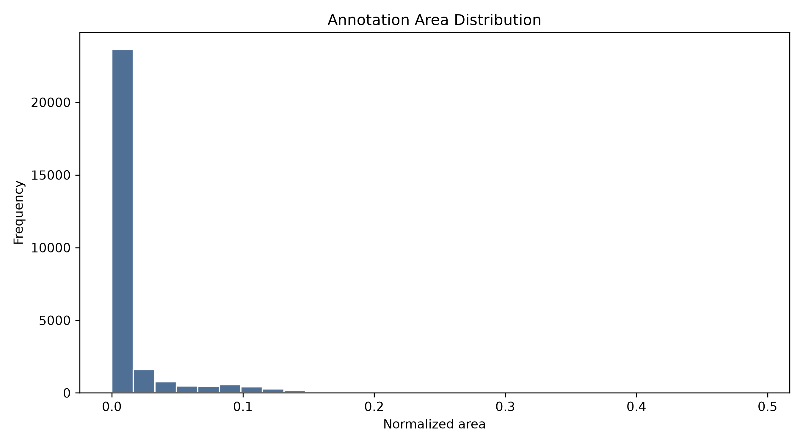
**Figure 2. Annotation Area Distribution.** Figure 2 was included to make the dataset and annotation evidence inspectable rather than reducing it to a single summary number. It is titled “Annotation Area Distribution” and is sourced from the repository figure export. The axis labels printed in the original graphic define the displayed variables and units; this report does not relabel them with unsupported units. Where this figure is part of the comparative prediction analysis, it uses the sample size is defined by the source analysis and is not inferred from pixels alone. The visible pattern should be read together with the associated table and the model/input provenance. It can show distribution, convergence, ranking, residual spread or sample-level variation, but it cannot establish causal visual mechanisms. The result should be read within the stated evidence boundary: targets are image-geometry research labels rather than recorded control commands, and any oracle-mask result is not a deployment-equivalent result.

## 3. Dataset and Data Organization

### Dataset overview and structure
The audited archive is a Roboflow-style YOLO polygon segmentation dataset. The original tree contains 803 image files and 802 labels; an unmatched hidden checkpoint artifact is excluded from usable analysis. The resulting usable split contains 602 training, 120 validation and 80 test samples. Images are represented at 640 by 640 pixels in the project configuration. Image files and polygon labels are held in split-specific folders so training decisions can be separated from validation and final test evaluation.

The result should be read within the stated evidence boundary: targets are image-geometry research labels rather than recorded control commands, and any oracle-mask result is not a deployment-equivalent result.

### Annotations and semantic classes
A YOLO polygon row begins with a numeric class identifier followed by normalized x,y polygon coordinates. The confirmed semantic mapping is 0 path, 1 cassava_leaves and 2 ridge. Path is the travelable visual corridor represented in the image; cassava leaves represent vegetation that can occlude or constrain that corridor; ridge represents soil-row structure. These class names describe scene semantics, not direct actuation instructions.

The result should be read within the stated evidence boundary: targets are image-geometry research labels rather than recorded control commands, and any oracle-mask result is not a deployment-equivalent result.

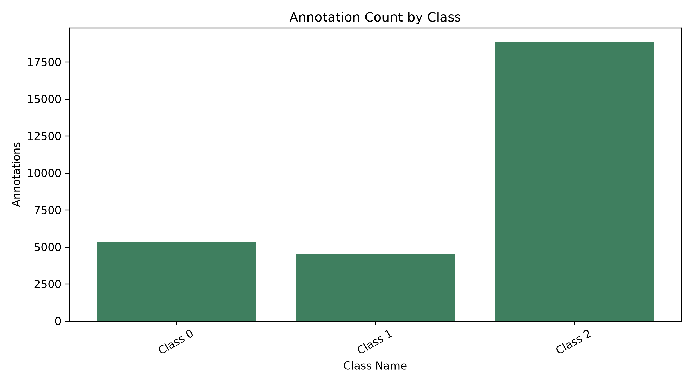
**Figure 3. Annotation Count By Class.** Figure 3 was included to make the dataset and annotation evidence inspectable rather than reducing it to a single summary number. It is titled “Annotation Count By Class” and is sourced from the repository figure export. The axis labels printed in the original graphic define the displayed variables and units; this report does not relabel them with unsupported units. Where this figure is part of the comparative prediction analysis, it uses the sample size is defined by the source analysis and is not inferred from pixels alone. The visible pattern should be read together with the associated table and the model/input provenance. It can show distribution, convergence, ranking, residual spread or sample-level variation, but it cannot establish causal visual mechanisms. The result should be read within the stated evidence boundary: targets are image-geometry research labels rather than recorded control commands, and any oracle-mask result is not a deployment-equivalent result.

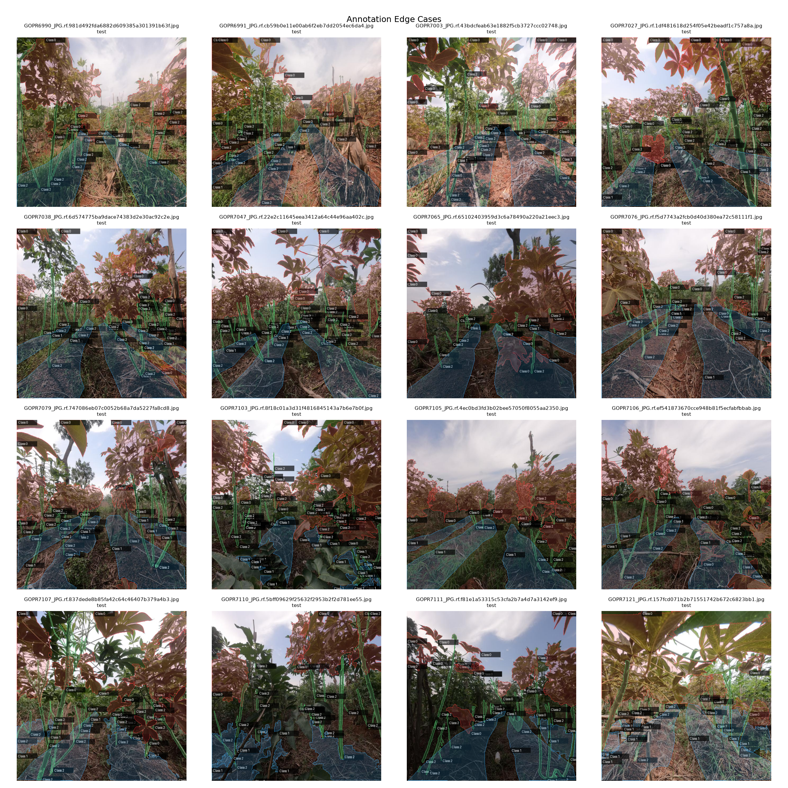
**Figure 4. Annotation Edge Cases.** Figure 4 was included to make the dataset and annotation evidence inspectable rather than reducing it to a single summary number. It is titled “Annotation Edge Cases” and is sourced from the repository figure export. The axis labels printed in the original graphic define the displayed variables and units; this report does not relabel them with unsupported units. Where this figure is part of the comparative prediction analysis, it uses the sample size is defined by the source analysis and is not inferred from pixels alone. The visible pattern should be read together with the associated table and the model/input provenance. It can show distribution, convergence, ranking, residual spread or sample-level variation, but it cannot establish causal visual mechanisms. The result should be read within the stated evidence boundary: targets are image-geometry research labels rather than recorded control commands, and any oracle-mask result is not a deployment-equivalent result.

## 4. Dataset Audit and Annotation Validation

### Audit procedure
The audit matched images and labels, parsed every compatible polygon row, measured image and polygon properties, screened corrupt/system artifacts, checked split membership, and computed exact hashes to find duplicate files. It verified 28,655 structurally valid polygons. The audit treats hidden notebook artifacts separately instead of changing original data. This distinction preserves the source record while making the derived training view reproducible.

The result should be read within the stated evidence boundary: targets are image-geometry research labels rather than recorded control commands, and any oracle-mask result is not a deployment-equivalent result.

### Quality findings
The validation found 216 size-related review warnings: 198 extremely small and 18 extremely large polygons. It placed 278 images in a manual-review queue. These are not automatically annotation errors; unusual object scale can be real in a farm scene. Exact-hash checks found no cross-split duplicates, but exact matching cannot rule out adjacent video frames, repeated plants, nearby locations or acquisition-session correlation.

The result should be read within the stated evidence boundary: targets are image-geometry research labels rather than recorded control commands, and any oracle-mask result is not a deployment-equivalent result.

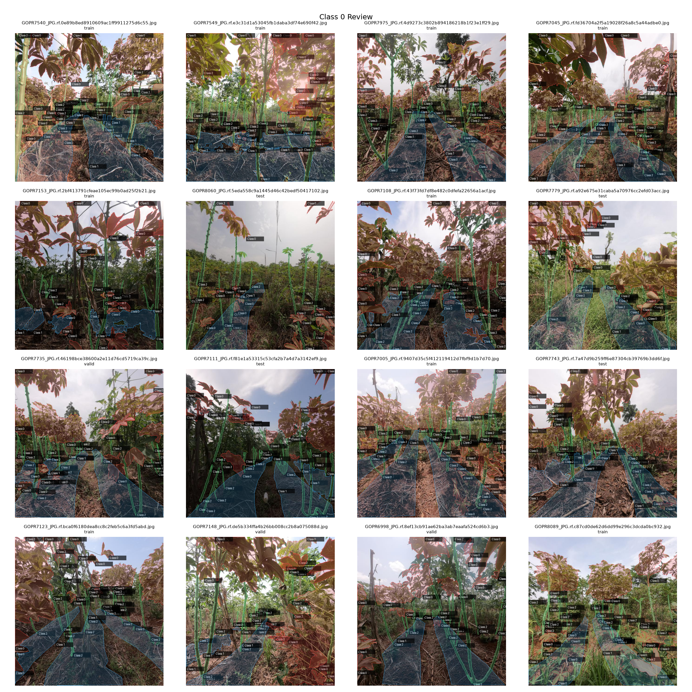
**Figure 5. Class 0 Review.** Figure 5 was included to make the dataset and annotation evidence inspectable rather than reducing it to a single summary number. It is titled “Class 0 Review” and is sourced from the repository figure export. The axis labels printed in the original graphic define the displayed variables and units; this report does not relabel them with unsupported units. Where this figure is part of the comparative prediction analysis, it uses the sample size is defined by the source analysis and is not inferred from pixels alone. The visible pattern should be read together with the associated table and the model/input provenance. It can show distribution, convergence, ranking, residual spread or sample-level variation, but it cannot establish causal visual mechanisms. The result should be read within the stated evidence boundary: targets are image-geometry research labels rather than recorded control commands, and any oracle-mask result is not a deployment-equivalent result.

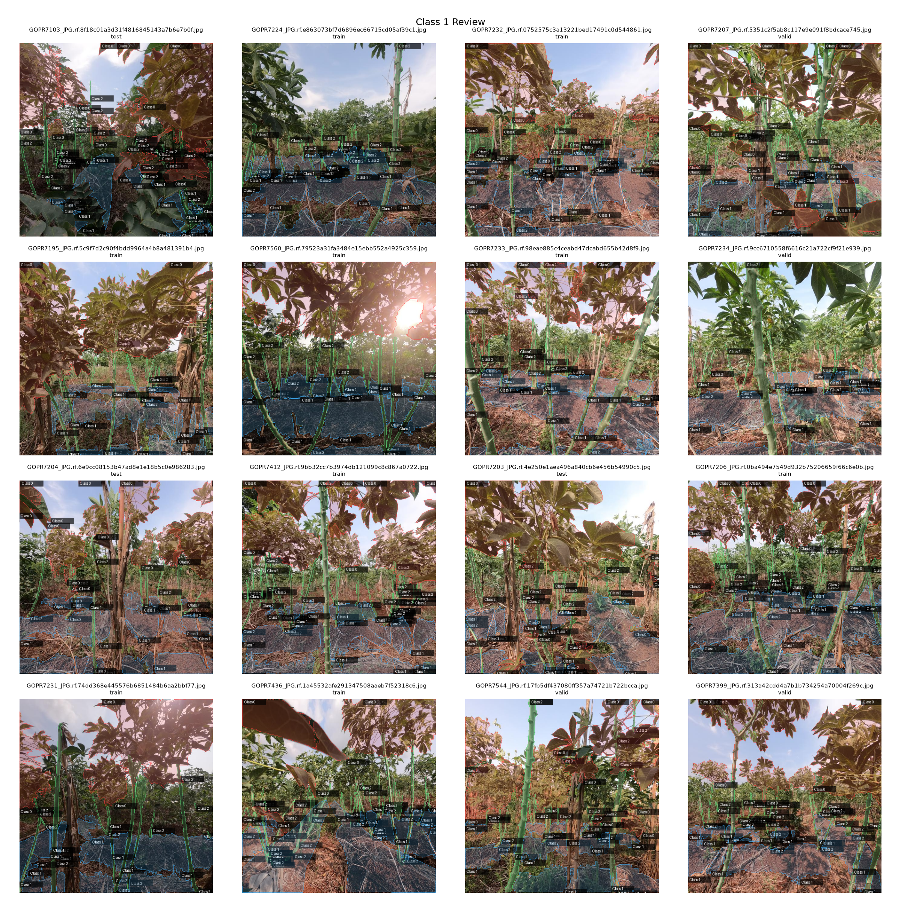
**Figure 6. Class 1 Review.** Figure 6 was included to make the dataset and annotation evidence inspectable rather than reducing it to a single summary number. It is titled “Class 1 Review” and is sourced from the repository figure export. The axis labels printed in the original graphic define the displayed variables and units; this report does not relabel them with unsupported units. Where this figure is part of the comparative prediction analysis, it uses the sample size is defined by the source analysis and is not inferred from pixels alone. The visible pattern should be read together with the associated table and the model/input provenance. It can show distribution, convergence, ranking, residual spread or sample-level variation, but it cannot establish causal visual mechanisms. The result should be read within the stated evidence boundary: targets are image-geometry research labels rather than recorded control commands, and any oracle-mask result is not a deployment-equivalent result.

## 5. Image Preprocessing and Experiment Preparation

### Preparation principles
The repository retains original split membership and creates a derived training view rather than rewriting source labels. The segmentation configuration specifies 640-pixel inputs, 80 maximum epochs, batch size 8 and a fixed seed. The baseline report documents restrained brightness/saturation, rotation, scale and translation policies; horizontal/vertical flips, mosaic and mixup are not enabled because their geometry could lack navigation justification. Image models use their saved experiment preprocessing; missing detailed transform histories are not reverse-engineered from result files.

The result should be read within the stated evidence boundary: targets are image-geometry research labels rather than recorded control commands, and any oracle-mask result is not a deployment-equivalent result.

### Why separation matters
Training data are used to fit parameters, validation data support model selection/early stopping, and test data are reserved for frozen choices. This design reduces optimistic reporting, although it does not remove all risks introduced by dataset size, field correlation or target derivation.

The result should be read within the stated evidence boundary: targets are image-geometry research labels rather than recorded control commands, and any oracle-mask result is not a deployment-equivalent result.

## 6. Cassava Farm Scene Segmentation

### Role and implementation status
Segmentation is appropriate when the location and shape of the path, leaves and ridges matter. Classification would label the whole image and object detection would estimate boxes; neither directly provides the path boundaries used in geometric reasoning. The repository contains a YOLO segmentation workflow and a planned yolo11n-seg configuration. However, the locally stored baseline metrics explicitly report status not_trained. Accordingly, this report explains the implemented methodology but does not report historical approximate precision, recall, mAP, per-class AP, masks, inference FPS or failure cases as verified results.

The result should be read within the stated evidence boundary: targets are image-geometry research labels rather than recorded control commands, and any oracle-mask result is not a deployment-equivalent result.

### Evaluation framework
For a completed segmentation run, IoU would quantify mask overlap, precision would measure how often predicted instances are correct, recall would measure how much labelled content is recovered, and mAP would summarise precision-recall performance at specified IoU thresholds. These concepts are necessary for interpreting a future run, but they are not evidence that this checkout achieved a particular segmentation value. A predicted-mask feature pipeline is likewise absent, which materially limits deployment-oriented comparison.

The result should be read within the stated evidence boundary: targets are image-geometry research labels rather than recorded control commands, and any oracle-mask result is not a deployment-equivalent result.

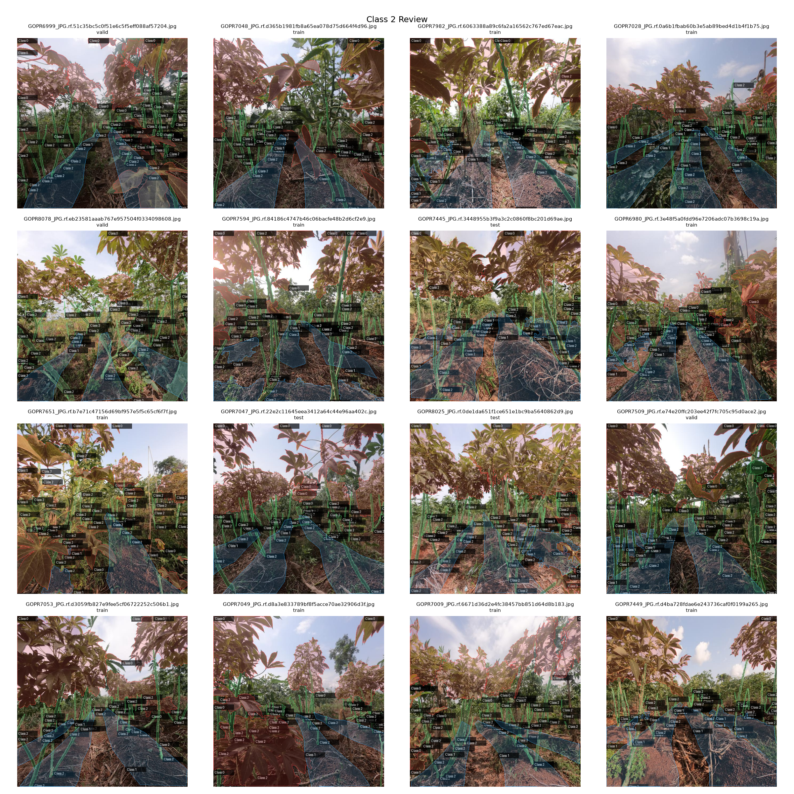
**Figure 7. Class 2 Review.** Figure 7 was included to make the dataset and annotation evidence inspectable rather than reducing it to a single summary number. It is titled “Class 2 Review” and is sourced from the repository figure export. The axis labels printed in the original graphic define the displayed variables and units; this report does not relabel them with unsupported units. Where this figure is part of the comparative prediction analysis, it uses the sample size is defined by the source analysis and is not inferred from pixels alone. The visible pattern should be read together with the associated table and the model/input provenance. It can show distribution, convergence, ranking, residual spread or sample-level variation, but it cannot establish causal visual mechanisms. The result should be read within the stated evidence boundary: targets are image-geometry research labels rather than recorded control commands, and any oracle-mask result is not a deployment-equivalent result.

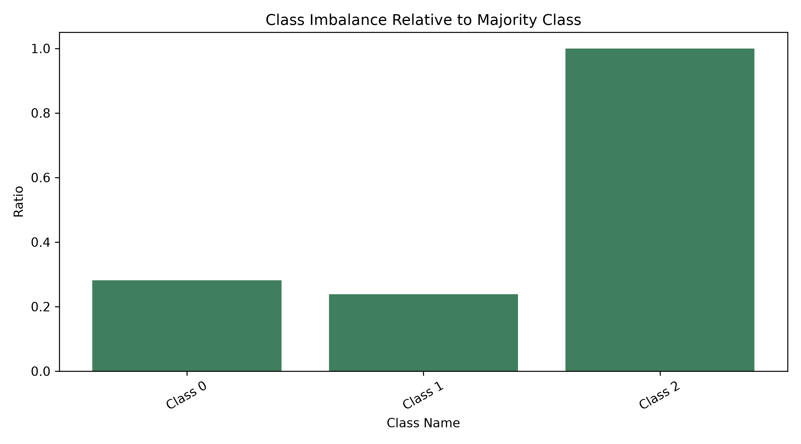
**Figure 8. Class Imbalance.** Figure 8 was included to make the dataset and annotation evidence inspectable rather than reducing it to a single summary number. It is titled “Class Imbalance” and is sourced from the repository figure export. The axis labels printed in the original graphic define the displayed variables and units; this report does not relabel them with unsupported units. Where this figure is part of the comparative prediction analysis, it uses the sample size is defined by the source analysis and is not inferred from pixels alone. The visible pattern should be read together with the associated table and the model/input provenance. It can show distribution, convergence, ranking, residual spread or sample-level variation, but it cannot establish causal visual mechanisms. The result should be read within the stated evidence boundary: targets are image-geometry research labels rather than recorded control commands, and any oracle-mask result is not a deployment-equivalent result.

## 7. Navigation Information Extraction

### Geometry-derived continuous target
The implementation defines normalized path-centre offset as (path_center_x - image_center_x) / (image_width / 2). Here path_center_x is the horizontal centre estimated from path geometry, image_center_x is half the image width, and the denominator expresses displacement in half-image-width units. Negative values indicate the path centre lies left of image centre; values near zero indicate alignment; positive values indicate it lies right. The equation creates an image-geometry label, not a command convention.

The result should be read within the stated evidence boundary: targets are image-geometry research labels rather than recorded control commands, and any oracle-mask result is not a deployment-equivalent result.

### Directional policy
The stored policy uses left threshold -0.15 and right threshold 0.15. It also stores lower-region, area, width, continuity and uncertainty guards, including stop_uncertain_threshold 0.60. Primary Phase B directional classification uses left, forward and right; stop_or_uncertain is intentionally excluded from that primary classification. These thresholds should be treated as a documented provisional policy, not a validated vehicle-control law.

The result should be read within the stated evidence boundary: targets are image-geometry research labels rather than recorded control commands, and any oracle-mask result is not a deployment-equivalent result.

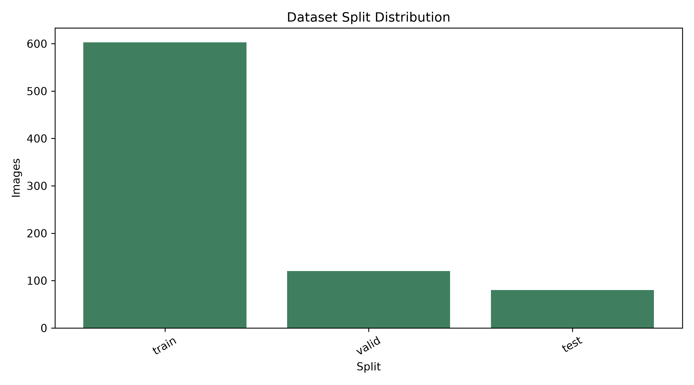
**Figure 9. Dataset Split Distribution.** Figure 9 was included to make the dataset and annotation evidence inspectable rather than reducing it to a single summary number. It is titled “Dataset Split Distribution” and is sourced from the repository figure export. The axis labels printed in the original graphic define the displayed variables and units; this report does not relabel them with unsupported units. Where this figure is part of the comparative prediction analysis, it uses the sample size is defined by the source analysis and is not inferred from pixels alone. The visible pattern should be read together with the associated table and the model/input provenance. It can show distribution, convergence, ranking, residual spread or sample-level variation, but it cannot establish causal visual mechanisms. The result should be read within the stated evidence boundary: targets are image-geometry research labels rather than recorded control commands, and any oracle-mask result is not a deployment-equivalent result.

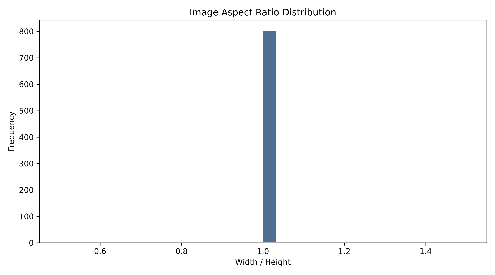
**Figure 10. Image Aspect Ratio Distribution.** Figure 10 was included to make the dataset and annotation evidence inspectable rather than reducing it to a single summary number. It is titled “Image Aspect Ratio Distribution” and is sourced from the repository figure export. The axis labels printed in the original graphic define the displayed variables and units; this report does not relabel them with unsupported units. Where this figure is part of the comparative prediction analysis, it uses the sample size is defined by the source analysis and is not inferred from pixels alone. The visible pattern should be read together with the associated table and the model/input provenance. It can show distribution, convergence, ranking, residual spread or sample-level variation, but it cannot establish causal visual mechanisms. The result should be read within the stated evidence boundary: targets are image-geometry research labels rather than recorded control commands, and any oracle-mask result is not a deployment-equivalent result.

## 8. Feature Engineering

### Feature families
The feature pipeline derives path, cassava and ridge geometry; colour summaries; texture; orientation; obstruction; imbalance and missingness indicators. Representative allowed compact features are cassava_imbalance, ridge_imbalance, ridge_orientation, cassava_lower_obstruction and edge_density. Colour/texture families include RGB/HSV statistics, Excess Green/Red, normalized green-red difference, GLCM descriptors, entropy and edge density. Explicit missing flags are preferable to silently treating absent scene elements as ordinary zero values.

The result should be read within the stated evidence boundary: targets are image-geometry research labels rather than recorded control commands, and any oracle-mask result is not a deployment-equivalent result.

### Meaning and limitation
Geometry can describe apparent path/row organisation; cassava coverage and imbalance can describe vegetation distribution; ridge orientation can express soil structure; colour and texture can capture visual appearance. These variables may be useful correlates but do not establish causation or a physical navigation action. The stored ground-truth table has 802 rows and 412 columns and is an oracle representation because it starts from annotations rather than a deployed predicted mask.

The result should be read within the stated evidence boundary: targets are image-geometry research labels rather than recorded control commands, and any oracle-mask result is not a deployment-equivalent result.

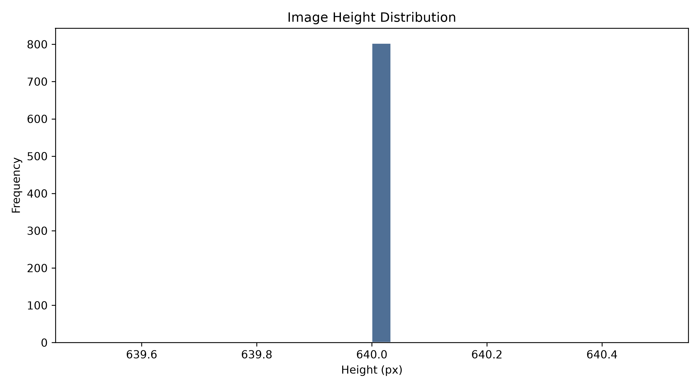
**Figure 11. Image Height Distribution.** Figure 11 was included to make the dataset and annotation evidence inspectable rather than reducing it to a single summary number. It is titled “Image Height Distribution” and is sourced from the repository figure export. The axis labels printed in the original graphic define the displayed variables and units; this report does not relabel them with unsupported units. Where this figure is part of the comparative prediction analysis, it uses the sample size is defined by the source analysis and is not inferred from pixels alone. The visible pattern should be read together with the associated table and the model/input provenance. It can show distribution, convergence, ranking, residual spread or sample-level variation, but it cannot establish causal visual mechanisms. The result should be read within the stated evidence boundary: targets are image-geometry research labels rather than recorded control commands, and any oracle-mask result is not a deployment-equivalent result.

**Figure 12. Image Width Distribution.** Figure 12 was included to make the dataset and annotation evidence inspectable rather than reducing it to a single summary number. It is titled “Image Width Distribution” and is sourced from the repository figure export. The axis labels printed in the original graphic define the displayed variables and units; this report does not relabel them with unsupported units. Where this figure is part of the comparative prediction analysis, it uses the sample size is defined by the source analysis and is not inferred from pixels alone. The visible pattern should be read together with the associated table and the model/input provenance. It can show distribution, convergence, ranking, residual spread or sample-level variation, but it cannot establish causal visual mechanisms. The result should be read within the stated evidence boundary: targets are image-geometry research labels rather than recorded control commands, and any oracle-mask result is not a deployment-equivalent result.

## 9. Target Leakage Prevention

### Leakage risk and exclusions
If the path centre is supplied as an input while normalized path offset is the output, the model can reconstruct the target algebraically. The feature-selection policy therefore excludes normalized_path_offset, its missing flag, path_center_x, absolute_path_deviation, path boundaries, width, area ratio, continuity, missing-path variables and related flags. Some of these also participate in target validity or stop/uncertain logic. Keeping them would turn the experiment into rule reconstruction rather than navigation prediction.

The result should be read within the stated evidence boundary: targets are image-geometry research labels rather than recorded control commands, and any oracle-mask result is not a deployment-equivalent result.

### Scientific importance
Leakage can make a model appear excellent while merely being handed an answer proxy. The exclusion policy is a methodological safeguard, but its provisional status and feature-source assumptions remain reportable limitations. The same principle applies to downstream segmentation: in-sample masks from a segmentation model fit on the same images should not be treated as out-of-fold navigation inputs.

The result should be read within the stated evidence boundary: targets are image-geometry research labels rather than recorded control commands, and any oracle-mask result is not a deployment-equivalent result.

## 10. Experimental Design

### Tasks, selection and test use
The project includes continuous regression of normalized offset and a three-class directional task. Saved evidence shows eligible regression counts of 297/56/42 for train/validation/test and directional counts of 116/22/16. The supplied report states that model selection uses validation only and test evaluation is performed after selection. In final comparative work, only models with saved per-image values can be independently recomputed.

The result should be read within the stated evidence boundary: targets are image-geometry research labels rather than recorded control commands, and any oracle-mask result is not a deployment-equivalent result.

### Common evaluation set
Random Forest, ANFIS, Custom CNN, MobileNetV3 and ResNet18 each supply exactly the same 42 saved image IDs. That makes their error differences paired. It does not make their input information equal: the first two use oracle ground-truth-mask features, while the three neural regressors are image-only. This is why statistical evidence about prediction errors must not be misreported as a direct deployment contest.

The result should be read within the stated evidence boundary: targets are image-geometry research labels rather than recorded control commands, and any oracle-mask result is not a deployment-equivalent result.

## 11. Classical Machine Learning for Continuous Navigation

### Completed model family
The model summary records dummy, ridge, KNN, Random Forest, SVR and gradient boosting regression experiments. These are feature-based models, and their inputs are labelled oracle in the stored summary. Their role is to compare simple baselines, linear regularisation, neighbourhood similarity, tree ensembles and kernel/boosted nonlinear relationships under the same provisional target definition. Individual validation rows are retained rather than silently replaced by later recomputation.

The result should be read within the stated evidence boundary: targets are image-geometry research labels rather than recorded control commands, and any oracle-mask result is not a deployment-equivalent result.

### Random Forest interpretation
A random forest averages decision trees trained on bootstrap samples while considering random feature subsets at each split. This can represent nonlinear interactions without requiring a parametric functional form. The independently recomputed saved test prediction set gives Random Forest MAE 0.451, RMSE 0.542 and R2 0.302 over 42 images. These values are numerically favourable in this export but use ground-truth-mask features and therefore represent an oracle upper bound rather than a field-ready pipeline.

The result should be read within the stated evidence boundary: targets are image-geometry research labels rather than recorded control commands, and any oracle-mask result is not a deployment-equivalent result.

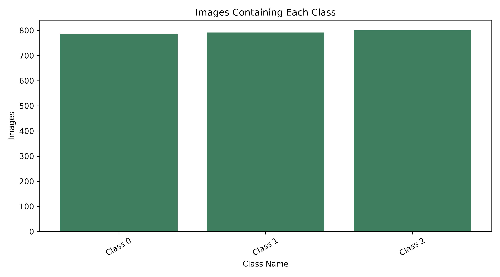
**Figure 13. Images Containing Each Class.** Figure 13 was included to make the dataset and annotation evidence inspectable rather than reducing it to a single summary number. It is titled “Images Containing Each Class” and is sourced from the repository figure export. The axis labels printed in the original graphic define the displayed variables and units; this report does not relabel them with unsupported units. Where this figure is part of the comparative prediction analysis, it uses the sample size is defined by the source analysis and is not inferred from pixels alone. The visible pattern should be read together with the associated table and the model/input provenance. It can show distribution, convergence, ranking, residual spread or sample-level variation, but it cannot establish causal visual mechanisms. The result should be read within the stated evidence boundary: targets are image-geometry research labels rather than recorded control commands, and any oracle-mask result is not a deployment-equivalent result.

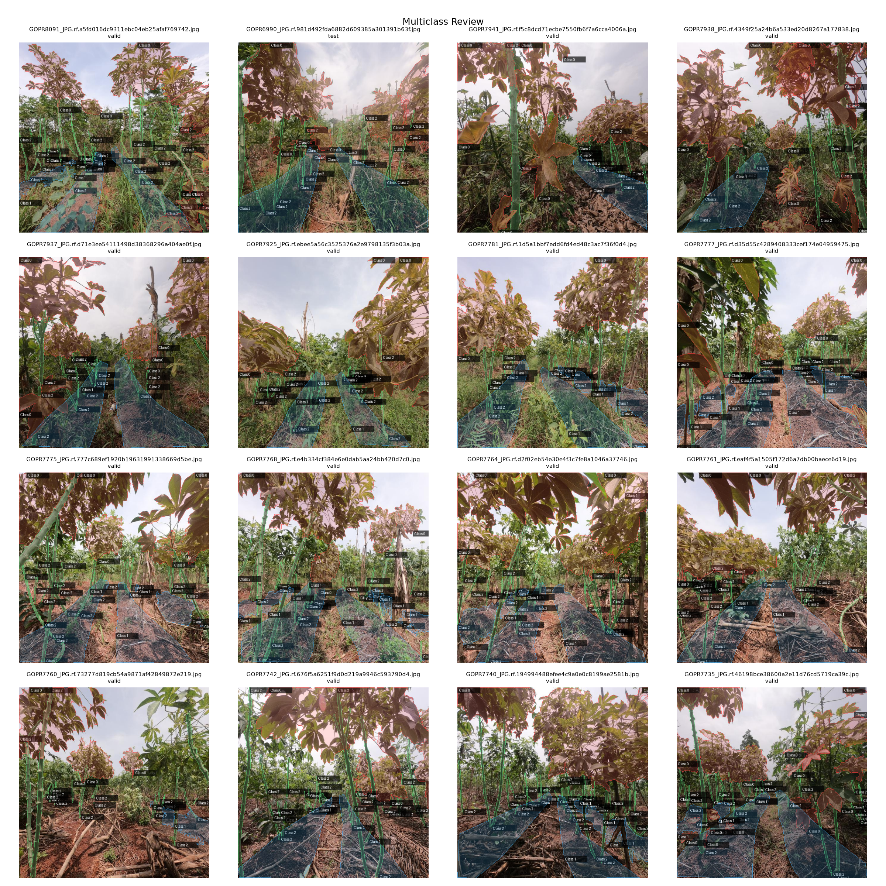
**Figure 14. Multiclass Review.** Figure 14 was included to make the dataset and annotation evidence inspectable rather than reducing it to a single summary number. It is titled “Multiclass Review” and is sourced from the repository figure export. The axis labels printed in the original graphic define the displayed variables and units; this report does not relabel them with unsupported units. Where this figure is part of the comparative prediction analysis, it uses the sample size is defined by the source analysis and is not inferred from pixels alone. The visible pattern should be read together with the associated table and the model/input provenance. It can show distribution, convergence, ranking, residual spread or sample-level variation, but it cannot establish causal visual mechanisms. The result should be read within the stated evidence boundary: targets are image-geometry research labels rather than recorded control commands, and any oracle-mask result is not a deployment-equivalent result.

## 12. Directional Classification

### Task and metrics
The directional target assigns left, forward or right according to the stored geometry thresholds. Accuracy counts all correct labels; balanced accuracy averages recall by class; precision measures correctness among predicted class members; recall measures recovered members; F1 balances precision and recall; macro averaging weights classes equally while weighted averaging weights support. Kappa adjusts observed agreement for class marginals and MCC summarises multiclass correlation.

The result should be read within the stated evidence boundary: targets are image-geometry research labels rather than recorded control commands, and any oracle-mask result is not a deployment-equivalent result.

### Corrected results and limits
Phase C recomputed classification metrics directly from saved actual and predicted hard labels for KNN, logistic regression and SVM. Logistic regression has 32 saved test predictions with accuracy 0.688 and macro F1 0.636; KNN has 16 predictions and SVM 32. The sparse test evidence makes per-class estimates unstable. The absence of genuine probability or decision-score exports correctly prevents ROC, AUC, precision-recall and calibration claims.

The result should be read within the stated evidence boundary: targets are image-geometry research labels rather than recorded control commands, and any oracle-mask result is not a deployment-equivalent result.

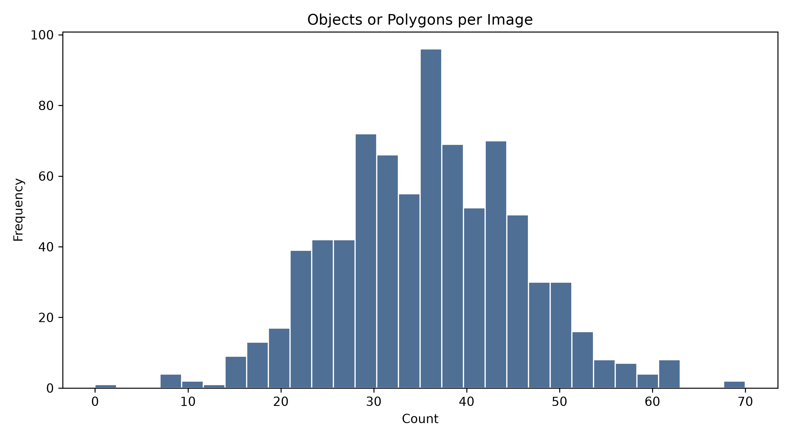
**Figure 15. Objects Per Image.** Figure 15 was included to make the dataset and annotation evidence inspectable rather than reducing it to a single summary number. It is titled “Objects Per Image” and is sourced from the repository figure export. The axis labels printed in the original graphic define the displayed variables and units; this report does not relabel them with unsupported units. Where this figure is part of the comparative prediction analysis, it uses the sample size is defined by the source analysis and is not inferred from pixels alone. The visible pattern should be read together with the associated table and the model/input provenance. It can show distribution, convergence, ranking, residual spread or sample-level variation, but it cannot establish causal visual mechanisms. The result should be read within the stated evidence boundary: targets are image-geometry research labels rather than recorded control commands, and any oracle-mask result is not a deployment-equivalent result.

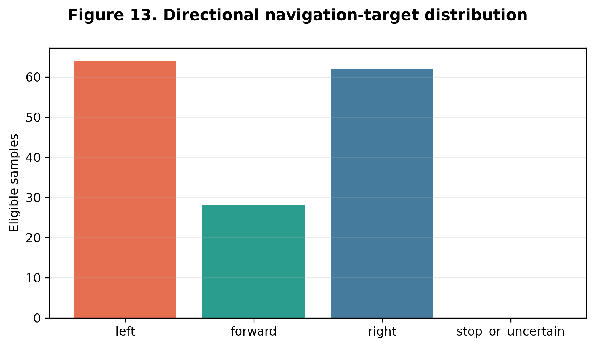
**Figure 16. Directional Navigation Target Distribution.** Figure 16 was included to make the segmentation and navigation evidence inspectable rather than reducing it to a single summary number. It is titled “Directional Navigation Target Distribution” and is sourced from the repository figure export. The axis labels printed in the original graphic define the displayed variables and units; this report does not relabel them with unsupported units. Where this figure is part of the comparative prediction analysis, it uses the sample size is defined by the source analysis and is not inferred from pixels alone. The visible pattern should be read together with the associated table and the model/input provenance. It can show distribution, convergence, ranking, residual spread or sample-level variation, but it cannot establish causal visual mechanisms. The result should be read within the stated evidence boundary: targets are image-geometry research labels rather than recorded control commands, and any oracle-mask result is not a deployment-equivalent result.

## 13. ANFIS Navigation Model

### Fuzzy-neural concept
ANFIS combines fuzzy membership functions and rules with trainable numeric consequents. An antecedent maps an input to membership strengths, a rule firing strength combines its antecedents, normalized firing strengths weight rule outputs, and the final output is a weighted combination. In a first-order Sugeno form, a rule can be written as IF inputs belong to fuzzy sets THEN f_i(x)=a_i^T x+b_i; the output is the sum of normalized rule strengths times f_i. This is a conceptual explanation of the recorded implementation, not a reconstructed parameter dump.

The result should be read within the stated evidence boundary: targets are image-geometry research labels rather than recorded control commands, and any oracle-mask result is not a deployment-equivalent result.

### Recorded configuration and result
The configuration stores five inputs: cassava_imbalance, ridge_imbalance, ridge_orientation, cassava_lower_obstruction and edge_density. It uses Gaussian memberships, three membership functions per input and 243 rules, consistent with 3 to the fifth power combinations. The saved 42-image predictions recompute to MAE 0.589, RMSE 0.657 and R2 -0.023. Membership-function parameters and a recoverable response surface are not supplied, so none is fabricated.

The result should be read within the stated evidence boundary: targets are image-geometry research labels rather than recorded control commands, and any oracle-mask result is not a deployment-equivalent result.

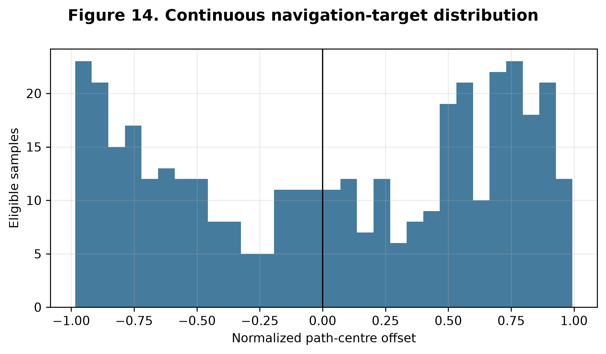
**Figure 17. Continuous Navigation Target Distribution.** Figure 17 was included to make the segmentation and navigation evidence inspectable rather than reducing it to a single summary number. It is titled “Continuous Navigation Target Distribution” and is sourced from the repository figure export. The axis labels printed in the original graphic define the displayed variables and units; this report does not relabel them with unsupported units. Where this figure is part of the comparative prediction analysis, it uses the sample size is defined by the source analysis and is not inferred from pixels alone. The visible pattern should be read together with the associated table and the model/input provenance. It can show distribution, convergence, ranking, residual spread or sample-level variation, but it cannot establish causal visual mechanisms. The result should be read within the stated evidence boundary: targets are image-geometry research labels rather than recorded control commands, and any oracle-mask result is not a deployment-equivalent result.

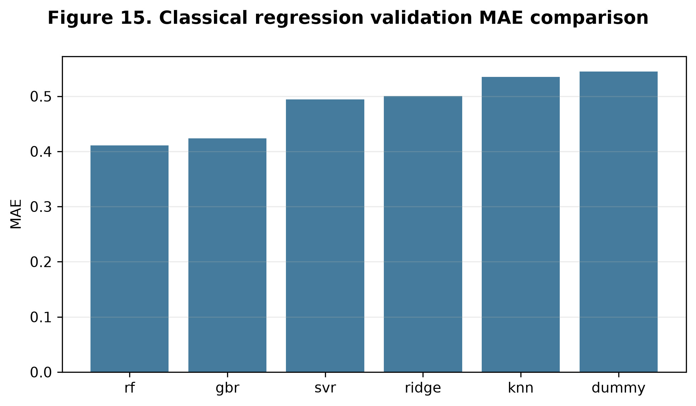
**Figure 18. Classical Regression Validation Mae Comparison.** Figure 18 was included to make the classical machine learning evidence inspectable rather than reducing it to a single summary number. It is titled “Classical Regression Validation Mae Comparison” and is sourced from the repository figure export. The axis labels printed in the original graphic define the displayed variables and units; this report does not relabel them with unsupported units. Where this figure is part of the comparative prediction analysis, it uses the sample size is defined by the source analysis and is not inferred from pixels alone. The visible pattern should be read together with the associated table and the model/input provenance. It can show distribution, convergence, ranking, residual spread or sample-level variation, but it cannot establish causal visual mechanisms. The result should be read within the stated evidence boundary: targets are image-geometry research labels rather than recorded control commands, and any oracle-mask result is not a deployment-equivalent result.

## 14. Custom CNN

### Image regression approach
A convolutional neural network learns spatial filters over image pixels, producing feature maps that are transformed into a scalar regression head. The supplied model metrics identify a Custom CNN image-regression experiment with 93,825 parameters. The saved validation MAE is 0.573 and test MAE/RMSE/R2 are 0.641/0.697/-0.152. A negative R2 means this prediction set performs worse than a constant mean-target baseline on the tested samples; it is not evidence that the model has no learned structure.

The result should be read within the stated evidence boundary: targets are image-geometry research labels rather than recorded control commands, and any oracle-mask result is not a deployment-equivalent result.

### Architecture evidence boundary
The stored metrics establish the output and parameter count. The report does not assert a layer-by-layer architecture, optimizer schedule or augmentation sequence beyond what the executed notebook/export records can support. The actual-versus-predicted and residual plots therefore take priority over invented architectural detail.

The result should be read within the stated evidence boundary: targets are image-geometry research labels rather than recorded control commands, and any oracle-mask result is not a deployment-equivalent result.

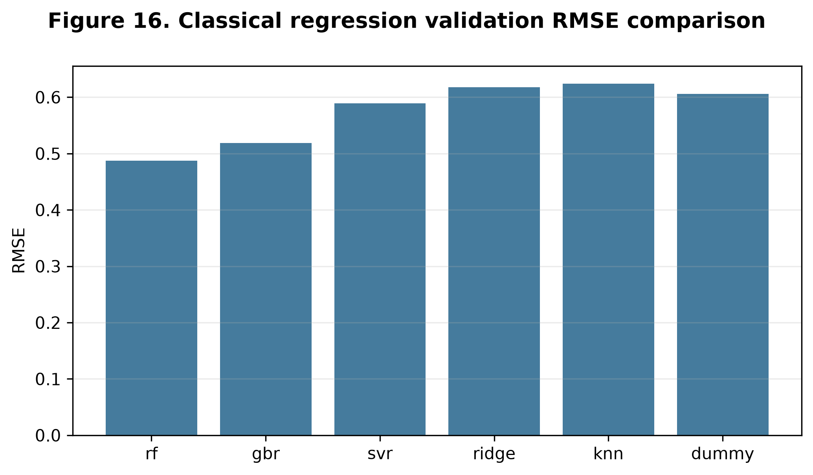
**Figure 19. Classical Regression Validation Rmse Comparison.** Figure 19 was included to make the classical machine learning evidence inspectable rather than reducing it to a single summary number. It is titled “Classical Regression Validation Rmse Comparison” and is sourced from the repository figure export. The axis labels printed in the original graphic define the displayed variables and units; this report does not relabel them with unsupported units. Where this figure is part of the comparative prediction analysis, it uses the sample size is defined by the source analysis and is not inferred from pixels alone. The visible pattern should be read together with the associated table and the model/input provenance. It can show distribution, convergence, ranking, residual spread or sample-level variation, but it cannot establish causal visual mechanisms. The result should be read within the stated evidence boundary: targets are image-geometry research labels rather than recorded control commands, and any oracle-mask result is not a deployment-equivalent result.

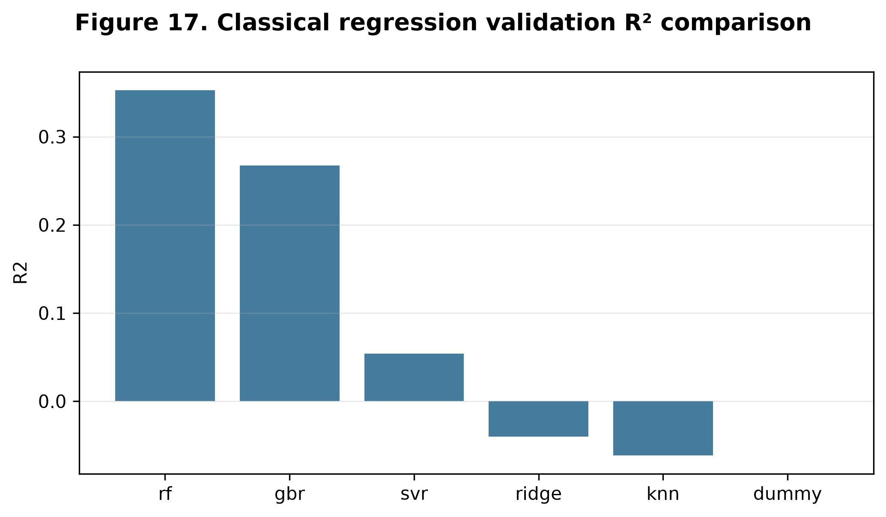
**Figure 20. Classical Regression Validation R² Comparison.** Figure 20 was included to make the classical machine learning evidence inspectable rather than reducing it to a single summary number. It is titled “Classical Regression Validation R² Comparison” and is sourced from the repository figure export. The axis labels printed in the original graphic define the displayed variables and units; this report does not relabel them with unsupported units. Where this figure is part of the comparative prediction analysis, it uses the sample size is defined by the source analysis and is not inferred from pixels alone. The visible pattern should be read together with the associated table and the model/input provenance. It can show distribution, convergence, ranking, residual spread or sample-level variation, but it cannot establish causal visual mechanisms. The result should be read within the stated evidence boundary: targets are image-geometry research labels rather than recorded control commands, and any oracle-mask result is not a deployment-equivalent result.

## 15. MobileNetV3 Transfer Learning

### Transfer learning rationale
Transfer learning begins from visual representations learned before the target task and adapts a final regression output to the new dataset. MobileNetV3 is designed for efficiency-oriented image processing, making it relevant to future constrained platforms. Relevance is not a deployment result: embedded memory, power, latency and accuracy must be measured on the actual target device.

The result should be read within the stated evidence boundary: targets are image-geometry research labels rather than recorded control commands, and any oracle-mask result is not a deployment-equivalent result.

### Observed result
The saved MobileNetV3 export uses images and contains 1,518,881 parameters. Its validation MAE is 0.558; independently recomputed test MAE/RMSE/R2 are 0.592/0.658/-0.029. Of the saved image-only regressors, it has the lowest MAE. Its stored inference measurement is approximately 0.322 seconds and 130.6 FPS, an internally inconsistent pair unless timing units/batching are clarified, so this report retains the raw columns but does not turn them into a cross-environment speed ranking.

The result should be read within the stated evidence boundary: targets are image-geometry research labels rather than recorded control commands, and any oracle-mask result is not a deployment-equivalent result.

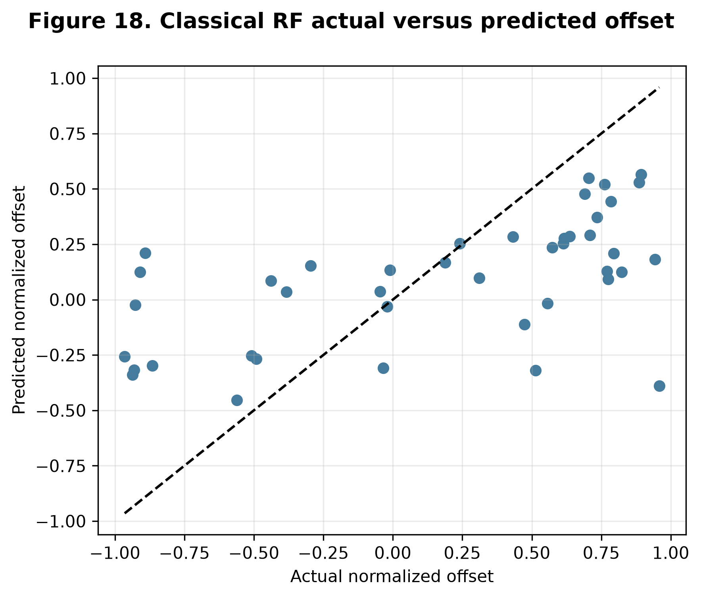
**Figure 21. Classical Rf Actual Versus Predicted Offset.** Figure 21 was included to make the classical machine learning evidence inspectable rather than reducing it to a single summary number. It is titled “Classical Rf Actual Versus Predicted Offset” and is sourced from the repository figure export. The axis labels printed in the original graphic define the displayed variables and units; this report does not relabel them with unsupported units. Where this figure is part of the comparative prediction analysis, it uses the sample size is defined by the source analysis and is not inferred from pixels alone. The visible pattern should be read together with the associated table and the model/input provenance. It can show distribution, convergence, ranking, residual spread or sample-level variation, but it cannot establish causal visual mechanisms. The result should be read within the stated evidence boundary: targets are image-geometry research labels rather than recorded control commands, and any oracle-mask result is not a deployment-equivalent result.

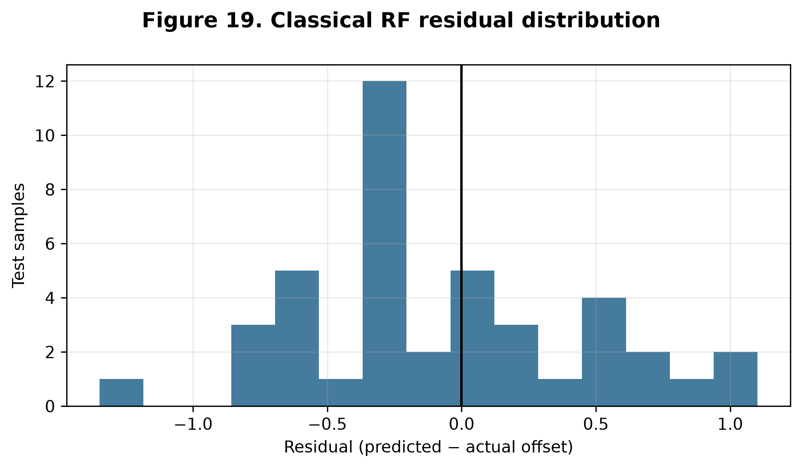
**Figure 22. Classical Rf Residual Distribution.** Figure 22 was included to make the classical machine learning evidence inspectable rather than reducing it to a single summary number. It is titled “Classical Rf Residual Distribution” and is sourced from the repository figure export. The axis labels printed in the original graphic define the displayed variables and units; this report does not relabel them with unsupported units. Where this figure is part of the comparative prediction analysis, it uses the sample size is defined by the source analysis and is not inferred from pixels alone. The visible pattern should be read together with the associated table and the model/input provenance. It can show distribution, convergence, ranking, residual spread or sample-level variation, but it cannot establish causal visual mechanisms. The result should be read within the stated evidence boundary: targets are image-geometry research labels rather than recorded control commands, and any oracle-mask result is not a deployment-equivalent result.

## 16. ResNet18 Transfer Learning

### Residual learning
Residual networks use skip connections so a block learns a residual transformation relative to its input. This can ease optimisation of deeper models by preserving an identity route. The supplied ResNet18 experiment is an image regression model with a modified scalar output head in the executed workflow context.

The result should be read within the stated evidence boundary: targets are image-geometry research labels rather than recorded control commands, and any oracle-mask result is not a deployment-equivalent result.

### Observed result
The stored export records 11,177,025 parameters, validation MAE 0.536, and recomputed 42-image test MAE/RMSE/R2 of 0.593/0.686/-0.117. Its validation MAE is slightly lower than MobileNetV3 in the saved metrics, while its test MAE is slightly higher. With only 42 test images and a non-significant adjusted paired difference between MobileNetV3 and ResNet18, that ordering should not be overinterpreted.

The result should be read within the stated evidence boundary: targets are image-geometry research labels rather than recorded control commands, and any oracle-mask result is not a deployment-equivalent result.

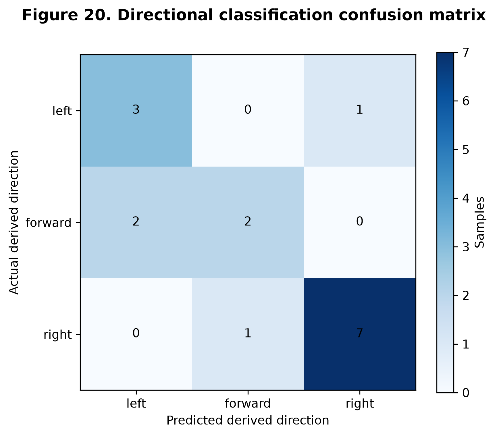
**Figure 23. Directional Classification Confusion Matrix.** Figure 23 was included to make the classical machine learning evidence inspectable rather than reducing it to a single summary number. It is titled “Directional Classification Confusion Matrix” and is sourced from the repository figure export. The axis labels printed in the original graphic define the displayed variables and units; this report does not relabel them with unsupported units. Where this figure is part of the comparative prediction analysis, it uses the sample size is defined by the source analysis and is not inferred from pixels alone. The visible pattern should be read together with the associated table and the model/input provenance. It can show distribution, convergence, ranking, residual spread or sample-level variation, but it cannot establish causal visual mechanisms. The result should be read within the stated evidence boundary: targets are image-geometry research labels rather than recorded control commands, and any oracle-mask result is not a deployment-equivalent result.

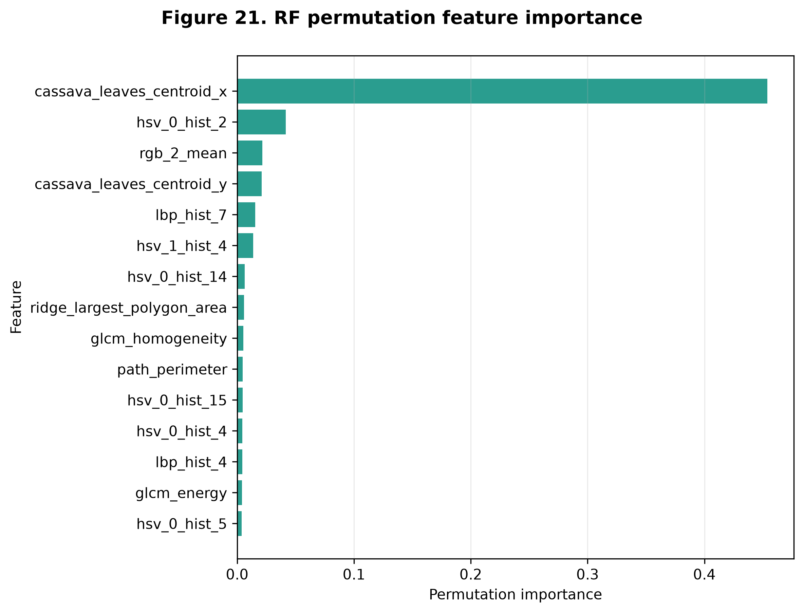
**Figure 24. Rf Permutation Feature Importance.** Figure 24 was included to make the classical machine learning evidence inspectable rather than reducing it to a single summary number. It is titled “Rf Permutation Feature Importance” and is sourced from the repository figure export. The axis labels printed in the original graphic define the displayed variables and units; this report does not relabel them with unsupported units. Where this figure is part of the comparative prediction analysis, it uses the sample size is defined by the source analysis and is not inferred from pixels alone. The visible pattern should be read together with the associated table and the model/input provenance. It can show distribution, convergence, ranking, residual spread or sample-level variation, but it cannot establish causal visual mechanisms. The result should be read within the stated evidence boundary: targets are image-geometry research labels rather than recorded control commands, and any oracle-mask result is not a deployment-equivalent result.

## 17. Evaluation Metrics

### Regression measures
MAE=(1/n) sum_i |y_i-yhat_i| gives average absolute normalized-offset error. RMSE=sqrt((1/n) sum_i (y_i-yhat_i)^2) gives larger errors more influence. R2=1-sum_i(y_i-yhat_i)^2/sum_i(y_i-ybar)^2 compares the model with the mean-target baseline. Median absolute error is a robust central error summary. In this project, all are computed against the geometry-derived offset, not a physical steering angle.

The result should be read within the stated evidence boundary: targets are image-geometry research labels rather than recorded control commands, and any oracle-mask result is not a deployment-equivalent result.

### Classification and segmentation measures
Precision=TP/(TP+FP), recall=TP/(TP+FN), and F1=2 precision recall/(precision+recall). IoU is overlap divided by union. mAP50 and mAP50-95 are segmentation ranking summaries across IoU criteria, but no verified local trained segmentation values are present. Definitions explain the future workflow; they must not be read as realised segmentation performance.

The result should be read within the stated evidence boundary: targets are image-geometry research labels rather than recorded control commands, and any oracle-mask result is not a deployment-equivalent result.

## 18. Complete Experimental Results

### Integrated evidence
The complete result record spans oracle-feature classical regression/classification, oracle-feature ANFIS, and image-only CNN/transfer regression. Independent verification is strongest where raw per-image predictions are available: five regression models share 42 IDs and classification exports allow hard-label recomputation. Other aggregate rows are documented as supplied outputs, not retuned or silently harmonised.

The result should be read within the stated evidence boundary: targets are image-geometry research labels rather than recorded control commands, and any oracle-mask result is not a deployment-equivalent result.

### Interpretation discipline
The smallest metric is not automatically the most useful model. Feature provenance, target validity, confidence interval width, failure patterns, test size and hardware conditions affect practical interpretation. The tables and figures below preserve that distinction.

The result should be read within the stated evidence boundary: targets are image-geometry research labels rather than recorded control commands, and any oracle-mask result is not a deployment-equivalent result.

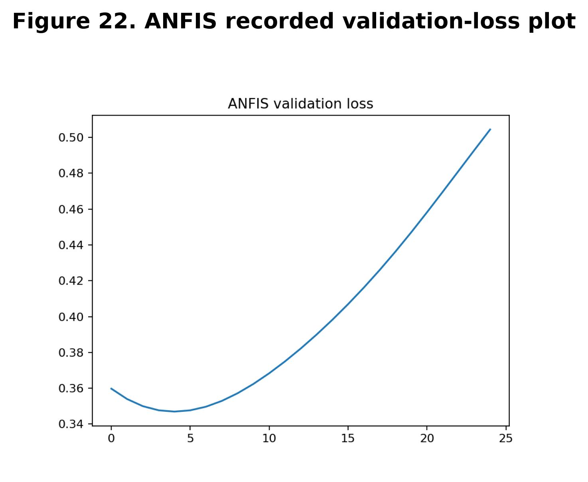
**Figure 25. Anfis Recorded Validation Loss Plot.** Figure 25 was included to make the anfis evidence inspectable rather than reducing it to a single summary number. It is titled “Anfis Recorded Validation Loss Plot” and is sourced from the repository figure export. The axis labels printed in the original graphic define the displayed variables and units; this report does not relabel them with unsupported units. Where this figure is part of the comparative prediction analysis, it uses the sample size is defined by the source analysis and is not inferred from pixels alone. The visible pattern should be read together with the associated table and the model/input provenance. It can show distribution, convergence, ranking, residual spread or sample-level variation, but it cannot establish causal visual mechanisms. The result should be read within the stated evidence boundary: targets are image-geometry research labels rather than recorded control commands, and any oracle-mask result is not a deployment-equivalent result.

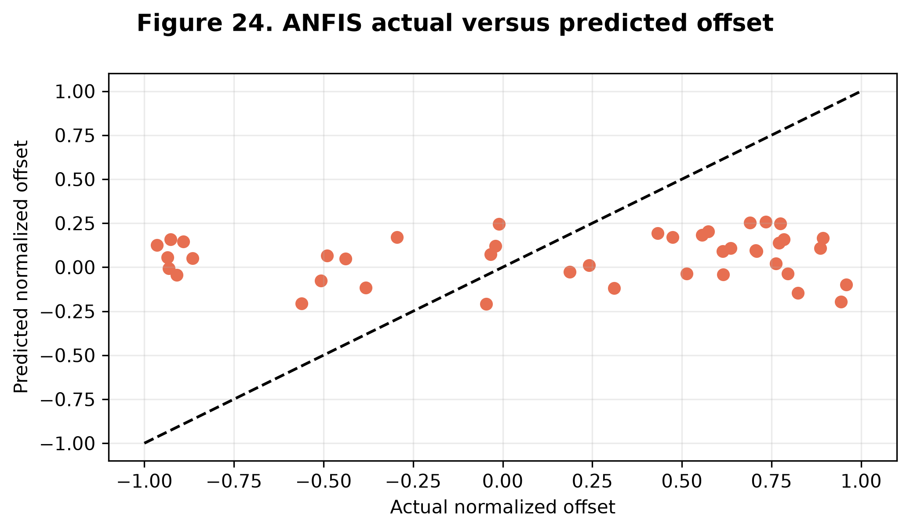
**Figure 26. Anfis Actual Versus Predicted Offset.** Figure 26 was included to make the anfis evidence inspectable rather than reducing it to a single summary number. It is titled “Anfis Actual Versus Predicted Offset” and is sourced from the repository figure export. The axis labels printed in the original graphic define the displayed variables and units; this report does not relabel them with unsupported units. Where this figure is part of the comparative prediction analysis, it uses the sample size is defined by the source analysis and is not inferred from pixels alone. The visible pattern should be read together with the associated table and the model/input provenance. It can show distribution, convergence, ranking, residual spread or sample-level variation, but it cannot establish causal visual mechanisms. The result should be read within the stated evidence boundary: targets are image-geometry research labels rather than recorded control commands, and any oracle-mask result is not a deployment-equivalent result.

## 19. Comparative Model Analysis

### Comparison structure
On the common set, Random Forest has the lowest saved MAE and RMSE. ANFIS is next in RMSE and MobileNetV3 is the best image-only MAE model. Error distributions show substantial overlap and sample-level variation. The oracle feature source of Random Forest and ANFIS is an informational advantage over image-only models, so their aggregate values are useful as upper-bound evidence but not a claim that an annotated mask will be available on a robot.

The result should be read within the stated evidence boundary: targets are image-geometry research labels rather than recorded control commands, and any oracle-mask result is not a deployment-equivalent result.

### Complexity
The three image models have recorded parameter counts and timing columns. Parameter counts can contextualise storage and compute requirements; timing requires measured hardware, batch, preprocessing and postprocessing semantics. The raw model metrics provide only partial context, so the report avoids a universal speed conclusion.

The result should be read within the stated evidence boundary: targets are image-geometry research labels rather than recorded control commands, and any oracle-mask result is not a deployment-equivalent result.

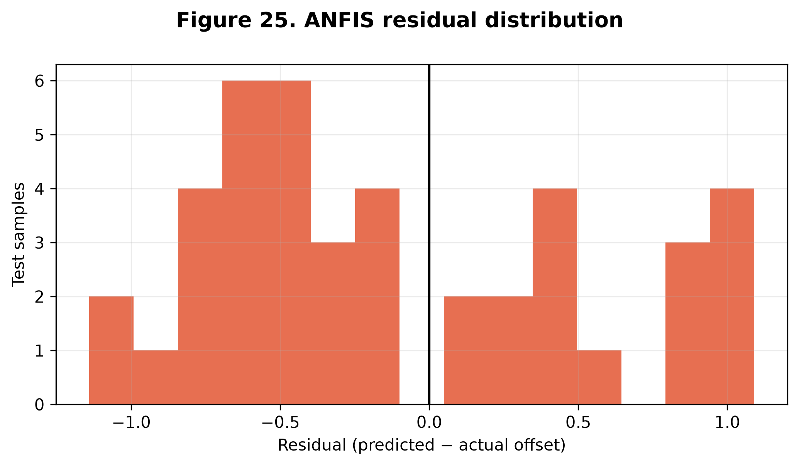
**Figure 27. Anfis Residual Distribution.** Figure 27 was included to make the anfis evidence inspectable rather than reducing it to a single summary number. It is titled “Anfis Residual Distribution” and is sourced from the repository figure export. The axis labels printed in the original graphic define the displayed variables and units; this report does not relabel them with unsupported units. Where this figure is part of the comparative prediction analysis, it uses the sample size is defined by the source analysis and is not inferred from pixels alone. The visible pattern should be read together with the associated table and the model/input provenance. It can show distribution, convergence, ranking, residual spread or sample-level variation, but it cannot establish causal visual mechanisms. The result should be read within the stated evidence boundary: targets are image-geometry research labels rather than recorded control commands, and any oracle-mask result is not a deployment-equivalent result.

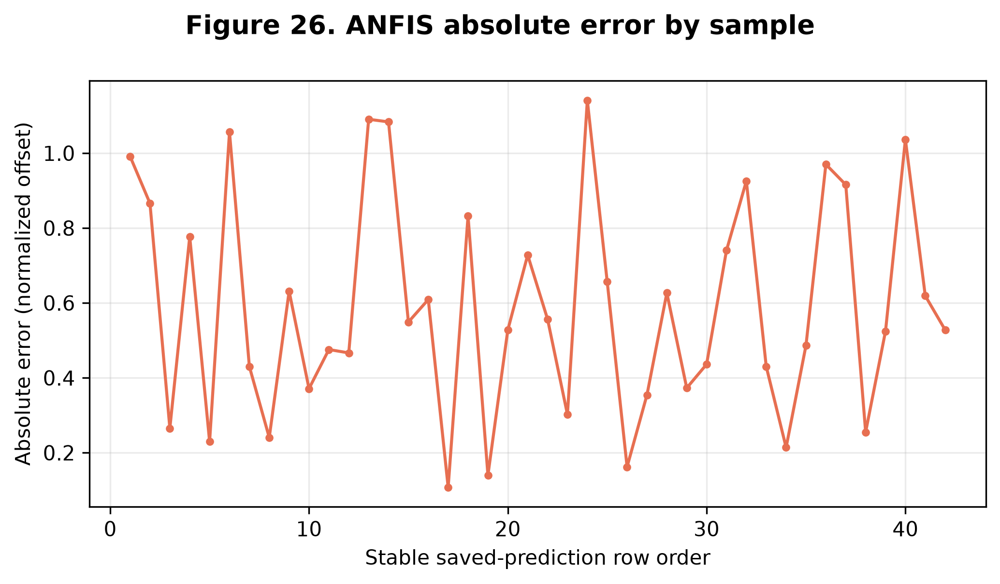
**Figure 28. Anfis Absolute Error By Sample.** Figure 28 was included to make the anfis evidence inspectable rather than reducing it to a single summary number. It is titled “Anfis Absolute Error By Sample” and is sourced from the repository figure export. The axis labels printed in the original graphic define the displayed variables and units; this report does not relabel them with unsupported units. Where this figure is part of the comparative prediction analysis, it uses the sample size is defined by the source analysis and is not inferred from pixels alone. The visible pattern should be read together with the associated table and the model/input provenance. It can show distribution, convergence, ranking, residual spread or sample-level variation, but it cannot establish causal visual mechanisms. The result should be read within the stated evidence boundary: targets are image-geometry research labels rather than recorded control commands, and any oracle-mask result is not a deployment-equivalent result.

## 20. Statistical Analysis

### Paired design and uncertainty
The common-test manifest confirms 42 identical image IDs for the five eligible models. Bootstrap percentile confidence intervals draw 5,000 image-level resamples with fixed seed 20260928. The paired Wilcoxon signed-rank test uses within-image absolute-error differences rather than aggregate RMSE values. Holm correction adjusts the family of pairwise p-values. These choices address sampling variation and multiple comparisons, not target validity or external generalisation.

The result should be read within the stated evidence boundary: targets are image-geometry research labels rather than recorded control commands, and any oracle-mask result is not a deployment-equivalent result.

### Findings
The adjusted comparisons support different paired absolute errors between Random Forest and ANFIS, Custom CNN and MobileNetV3. The Random Forest versus ResNet18 comparison has adjusted p 0.063 and is not labelled significant at 0.05. Most non-Random-Forest pairings have no adjusted evidence of a difference. Statistical significance is neither an explanation of model behaviour nor a guarantee of practical advantage.

The result should be read within the stated evidence boundary: targets are image-geometry research labels rather than recorded control commands, and any oracle-mask result is not a deployment-equivalent result.

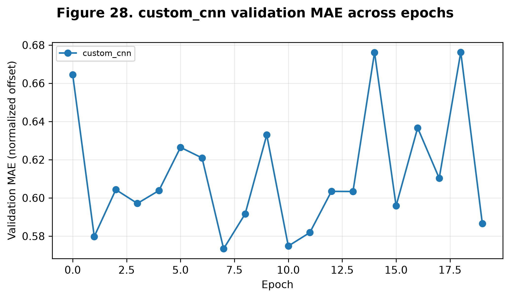
**Figure 29. Custom Cnn Validation Mae Across Epochs.** Figure 29 was included to make the image-based deep learning evidence inspectable rather than reducing it to a single summary number. It is titled “Custom Cnn Validation Mae Across Epochs” and is sourced from the repository figure export. The axis labels printed in the original graphic define the displayed variables and units; this report does not relabel them with unsupported units. Where this figure is part of the comparative prediction analysis, it uses the sample size is defined by the source analysis and is not inferred from pixels alone. The visible pattern should be read together with the associated table and the model/input provenance. It can show distribution, convergence, ranking, residual spread or sample-level variation, but it cannot establish causal visual mechanisms. The result should be read within the stated evidence boundary: targets are image-geometry research labels rather than recorded control commands, and any oracle-mask result is not a deployment-equivalent result.

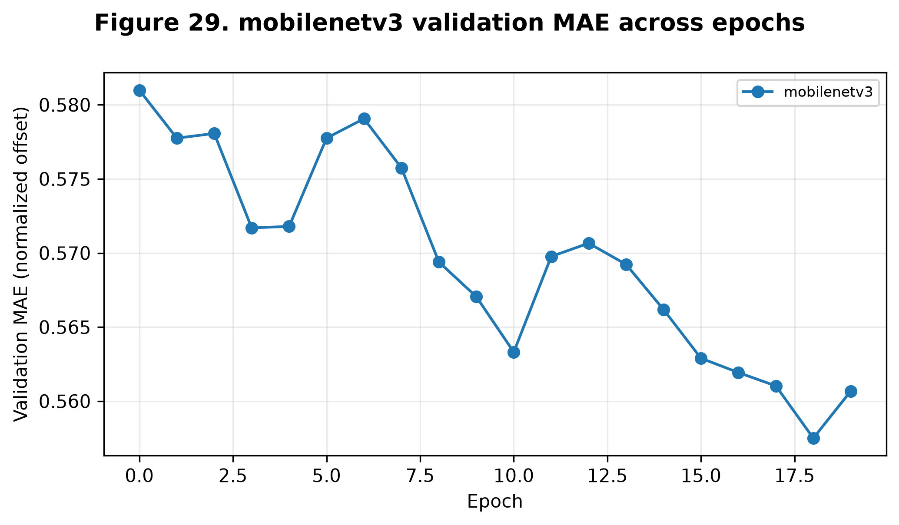
**Figure 30. Mobilenetv3 Validation Mae Across Epochs.** Figure 30 was included to make the image-based deep learning evidence inspectable rather than reducing it to a single summary number. It is titled “Mobilenetv3 Validation Mae Across Epochs” and is sourced from the repository figure export. The axis labels printed in the original graphic define the displayed variables and units; this report does not relabel them with unsupported units. Where this figure is part of the comparative prediction analysis, it uses the sample size is defined by the source analysis and is not inferred from pixels alone. The visible pattern should be read together with the associated table and the model/input provenance. It can show distribution, convergence, ranking, residual spread or sample-level variation, but it cannot establish causal visual mechanisms. The result should be read within the stated evidence boundary: targets are image-geometry research labels rather than recorded control commands, and any oracle-mask result is not a deployment-equivalent result.

## 21. Error and Failure Analysis

### Observed error patterns
The actual-versus-predicted panels and residual comparison plots show predictions often compressed toward the centre relative to large-magnitude offsets. Absolute-error boxplots expose sample-level spread that MAE alone hides. The report can identify numerical failure cases from saved predictions, but without a verified segmentation run it cannot attribute them to mask errors. Without controlled visual annotation, a hypothesised cause such as lighting, occlusion or ridge structure remains a hypothesis.

The result should be read within the stated evidence boundary: targets are image-geometry research labels rather than recorded control commands, and any oracle-mask result is not a deployment-equivalent result.

### What is not claimed
No direction-specific regression error claim is introduced when the relevant cross-tabulation is not saved. No individual image is portrayed as proving a causal failure mechanism. These omissions protect the report from turning plausible visual stories into unsupported findings.

The result should be read within the stated evidence boundary: targets are image-geometry research labels rather than recorded control commands, and any oracle-mask result is not a deployment-equivalent result.

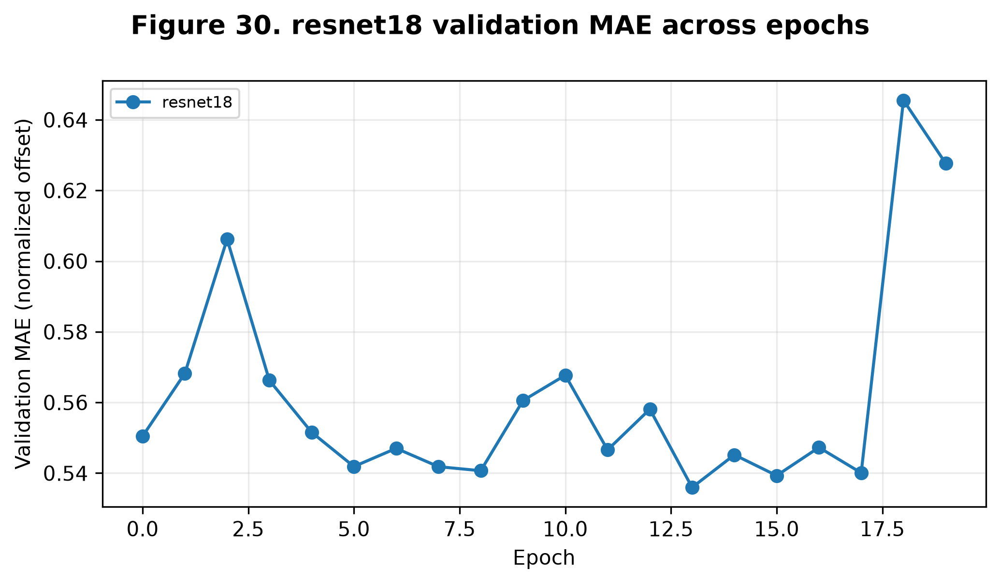
**Figure 31. Resnet18 Validation Mae Across Epochs.** Figure 31 was included to make the image-based deep learning evidence inspectable rather than reducing it to a single summary number. It is titled “Resnet18 Validation Mae Across Epochs” and is sourced from the repository figure export. The axis labels printed in the original graphic define the displayed variables and units; this report does not relabel them with unsupported units. Where this figure is part of the comparative prediction analysis, it uses the sample size is defined by the source analysis and is not inferred from pixels alone. The visible pattern should be read together with the associated table and the model/input provenance. It can show distribution, convergence, ranking, residual spread or sample-level variation, but it cannot establish causal visual mechanisms. The result should be read within the stated evidence boundary: targets are image-geometry research labels rather than recorded control commands, and any oracle-mask result is not a deployment-equivalent result.

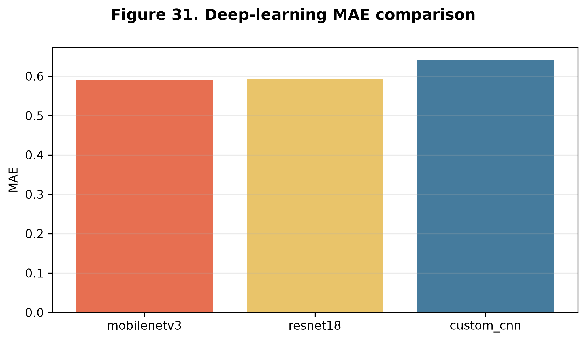
**Figure 32. Deep Learning Mae Comparison.** Figure 32 was included to make the image-based deep learning evidence inspectable rather than reducing it to a single summary number. It is titled “Deep Learning Mae Comparison” and is sourced from the repository figure export. The axis labels printed in the original graphic define the displayed variables and units; this report does not relabel them with unsupported units. Where this figure is part of the comparative prediction analysis, it uses the sample size is defined by the source analysis and is not inferred from pixels alone. The visible pattern should be read together with the associated table and the model/input provenance. It can show distribution, convergence, ranking, residual spread or sample-level variation, but it cannot establish causal visual mechanisms. The result should be read within the stated evidence boundary: targets are image-geometry research labels rather than recorded control commands, and any oracle-mask result is not a deployment-equivalent result.

## 22. Computational Performance

### Recorded computational evidence
The deep-model metrics export includes parameter count, inference_time and FPS columns. Custom CNN has 93,825 parameters, MobileNetV3 1,518,881 and ResNet18 11,177,025. This establishes a large capacity difference. The saved timing values must be read with their unknown environment/batch/preprocessing definitions; they are not a benchmark across all model families or a robot real-time certification.

The result should be read within the stated evidence boundary: targets are image-geometry research labels rather than recorded control commands, and any oracle-mask result is not a deployment-equivalent result.

### Deployment implications
An eventual robot requires measured end-to-end camera acquisition, preprocessing, inference, postprocessing, control-loop scheduling, thermal/power behaviour and safe fallback policy. Model size and parameter count are useful early constraints but cannot substitute for an on-device experiment.

The result should be read within the stated evidence boundary: targets are image-geometry research labels rather than recorded control commands, and any oracle-mask result is not a deployment-equivalent result.

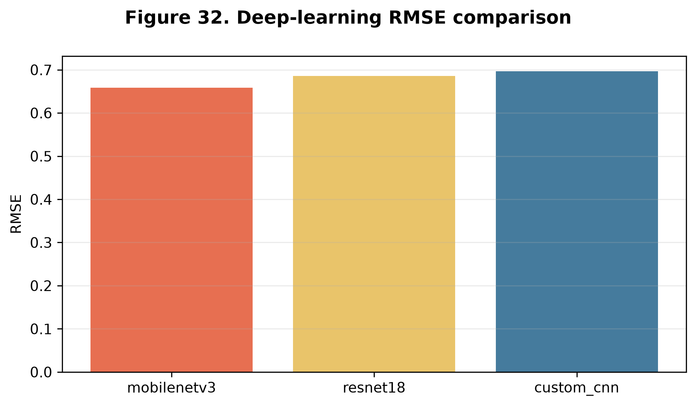
**Figure 33. Deep Learning Rmse Comparison.** Figure 33 was included to make the image-based deep learning evidence inspectable rather than reducing it to a single summary number. It is titled “Deep Learning Rmse Comparison” and is sourced from the repository figure export. The axis labels printed in the original graphic define the displayed variables and units; this report does not relabel them with unsupported units. Where this figure is part of the comparative prediction analysis, it uses the sample size is defined by the source analysis and is not inferred from pixels alone. The visible pattern should be read together with the associated table and the model/input provenance. It can show distribution, convergence, ranking, residual spread or sample-level variation, but it cannot establish causal visual mechanisms. The result should be read within the stated evidence boundary: targets are image-geometry research labels rather than recorded control commands, and any oracle-mask result is not a deployment-equivalent result.

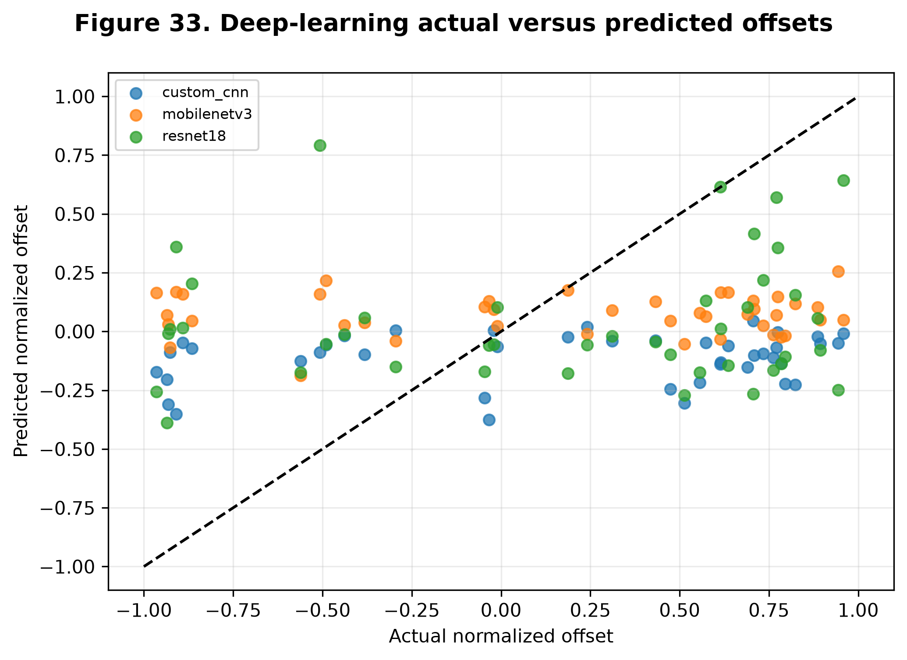
**Figure 34. Deep Learning Actual Versus Predicted Offsets.** Figure 34 was included to make the image-based deep learning evidence inspectable rather than reducing it to a single summary number. It is titled “Deep Learning Actual Versus Predicted Offsets” and is sourced from the repository figure export. The axis labels printed in the original graphic define the displayed variables and units; this report does not relabel them with unsupported units. Where this figure is part of the comparative prediction analysis, it uses the sample size is defined by the source analysis and is not inferred from pixels alone. The visible pattern should be read together with the associated table and the model/input provenance. It can show distribution, convergence, ranking, residual spread or sample-level variation, but it cannot establish causal visual mechanisms. The result should be read within the stated evidence boundary: targets are image-geometry research labels rather than recorded control commands, and any oracle-mask result is not a deployment-equivalent result.

## 23. Detailed Discussion

### Synthesis of experimental evidence
The strongest numerical predictor in the common export benefits from oracle geometry that a deployed system would not receive. That informational advantage plausibly explains part of its performance, but the present evidence does not partition its benefit quantitatively. ANFIS provides a compact interpretable-rule framing but does not outperform the oracle Random Forest. Image-only models avoid mask-source dependence but have limited data and their negative/near-zero R2 values indicate weak tested generalisation relative to mean prediction.

The result should be read within the stated evidence boundary: targets are image-geometry research labels rather than recorded control commands, and any oracle-mask result is not a deployment-equivalent result.

### Interpretation versus explanation
It is observed that MobileNetV3 has the best image-only MAE among saved exports and that paired uncertainty limits strong separation among several models. A possible explanation is that pretrained representations offer useful image features on a small dataset. That explanation is not experimentally isolated here; alternative causes include split composition, hyperparameter choice, derived target noise and unrecorded preprocessing details.

The result should be read within the stated evidence boundary: targets are image-geometry research labels rather than recorded control commands, and any oracle-mask result is not a deployment-equivalent result.

## 24. End-to-End System Interpretation

### Research pipeline and future interface
The implemented research system moves from field images and annotations to a navigation representation. A future operational system would need either a validated predicted-mask path or an image-only model, followed by a calibrated decision/control interface. The research representation could become one input to a controller, but it cannot itself provide safe motor commands.

The result should be read within the stated evidence boundary: targets are image-geometry research labels rather than recorded control commands, and any oracle-mask result is not a deployment-equivalent result.

### Boundary of implementation
No actuator, robot chassis, sensor fusion, steering controller, obstacle detector, calibration procedure, closed-loop trajectory or safety case is stored in this repository. Maintaining that boundary is necessary for responsible communication of results.

The result should be read within the stated evidence boundary: targets are image-geometry research labels rather than recorded control commands, and any oracle-mask result is not a deployment-equivalent result.

## 25. Limitations

### Evidence limitations
The primary limitations are dataset size and environmental diversity; geometry-derived targets; potential temporal/site correlation; oracle ground-truth feature source; absence of predicted-mask and out-of-fold features; locally untrained segmentation; small classification test exports; missing probability scores; incomplete training metadata; and unverified timing comparability. Each limits either external generalisation, deployment interpretation, uncertainty estimation or reproducibility.

The result should be read within the stated evidence boundary: targets are image-geometry research labels rather than recorded control commands, and any oracle-mask result is not a deployment-equivalent result.

### Consequences
The result should be read within the stated evidence boundary: targets are image-geometry research labels rather than recorded control commands, and any oracle-mask result is not a deployment-equivalent result.

The result should be read within the stated evidence boundary: targets are image-geometry research labels rather than recorded control commands, and any oracle-mask result is not a deployment-equivalent result.

## 26. Recommendations and Future Work

### Data and modelling
Future data collection should include multiple farms, seasons, lighting/weather conditions, occlusions and recorded steering or trajectory labels. A segmentation experiment should export checkpoints, per-class metrics, masks and out-of-fold predicted-mask features. Temporal models, depth, IMU/GPS where appropriate and sensor fusion could be evaluated only after target/control definitions are made physical and safety-relevant.

The result should be read within the stated evidence boundary: targets are image-geometry research labels rather than recorded control commands, and any oracle-mask result is not a deployment-equivalent result.

### Deployment and validation
Before integration, profile models on the selected edge device, investigate quantisation/pruning only against preserved accuracy criteria, calibrate camera geometry, establish command bounds and perform supervised closed-loop field trials with explicit safety controls. These are recommendations, not completed project stages.

The result should be read within the stated evidence boundary: targets are image-geometry research labels rather than recorded control commands, and any oracle-mask result is not a deployment-equivalent result.

## 27. Conclusion

### Conclusion
This report documents the complete available research chain from audited cassava images and polygon labels to geometry-derived navigation targets, oracle feature experiments, image regression models and final paired evaluation. It verifies that the saved oracle Random Forest has the lowest common-test error and that MobileNetV3 has the lowest image-only saved MAE. The central conclusion is qualified: the project supplies a reproducible AI/ML research basis, not a validated robot navigation controller.

The result should be read within the stated evidence boundary: targets are image-geometry research labels rather than recorded control commands, and any oracle-mask result is not a deployment-equivalent result.

## Appendices
### Appendix A. Additional Evidence Figures
The following figures are retained to make the report self-contained. Each is interpreted within its source and evidence limitations.

#### Figure 35: Resnet18 Largest Error Real Test Images
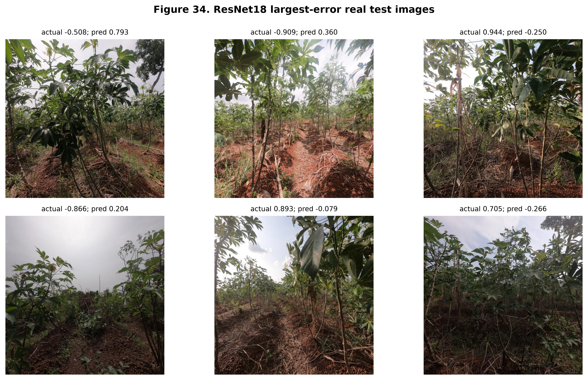
**Caption and interpretation.** Figure 35 was included to make the image-based deep learning evidence inspectable rather than reducing it to a single summary number. It is titled “Resnet18 Largest Error Real Test Images” and is sourced from the repository figure export. The axis labels printed in the original graphic define the displayed variables and units; this report does not relabel them with unsupported units. Where this figure is part of the comparative prediction analysis, it uses the sample size is defined by the source analysis and is not inferred from pixels alone. The visible pattern should be read together with the associated table and the model/input provenance. It can show distribution, convergence, ranking, residual spread or sample-level variation, but it cannot establish causal visual mechanisms. The result should be read within the stated evidence boundary: targets are image-geometry research labels rather than recorded control commands, and any oracle-mask result is not a deployment-equivalent result.

#### Figure 36: Overall Test Mae Comparison
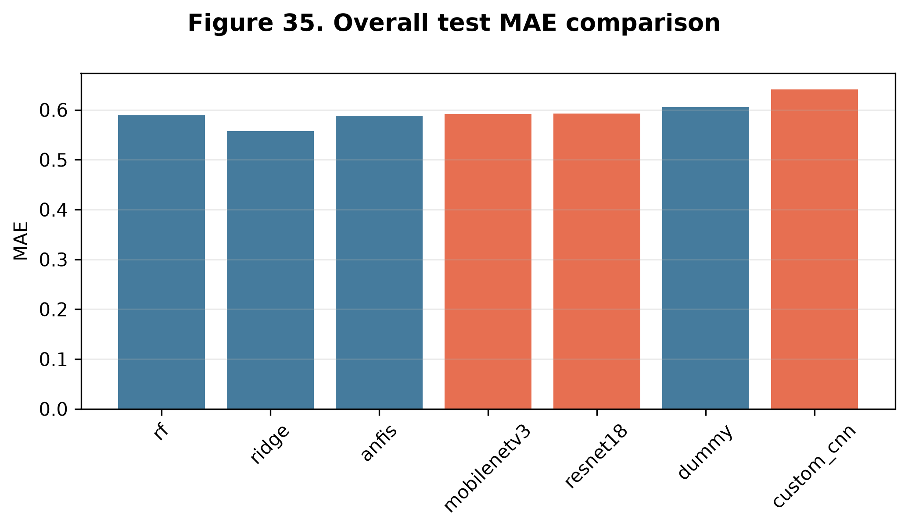
**Caption and interpretation.** Figure 36 was included to make the comparative analysis evidence inspectable rather than reducing it to a single summary number. It is titled “Overall Test Mae Comparison” and is sourced from the repository figure export. The axis labels printed in the original graphic define the displayed variables and units; this report does not relabel them with unsupported units. Where this figure is part of the comparative prediction analysis, it uses 42 aligned saved regression images. The visible pattern should be read together with the associated table and the model/input provenance. It can show distribution, convergence, ranking, residual spread or sample-level variation, but it cannot establish causal visual mechanisms. The result should be read within the stated evidence boundary: targets are image-geometry research labels rather than recorded control commands, and any oracle-mask result is not a deployment-equivalent result.

#### Figure 37: Overall Test Rmse Comparison
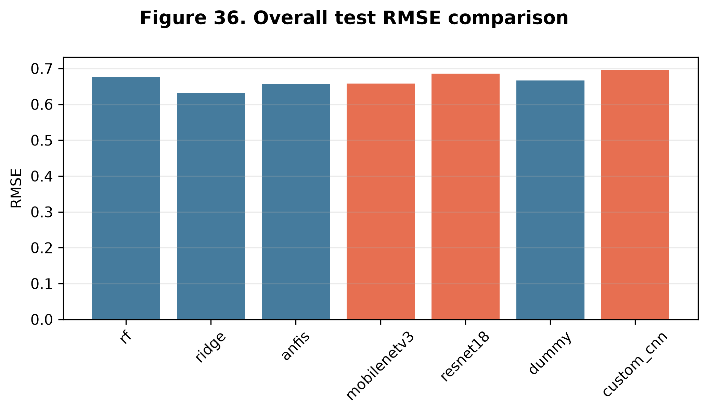
**Caption and interpretation.** Figure 37 was included to make the comparative analysis evidence inspectable rather than reducing it to a single summary number. It is titled “Overall Test Rmse Comparison” and is sourced from the repository figure export. The axis labels printed in the original graphic define the displayed variables and units; this report does not relabel them with unsupported units. Where this figure is part of the comparative prediction analysis, it uses 42 aligned saved regression images. The visible pattern should be read together with the associated table and the model/input provenance. It can show distribution, convergence, ranking, residual spread or sample-level variation, but it cannot establish causal visual mechanisms. The result should be read within the stated evidence boundary: targets are image-geometry research labels rather than recorded control commands, and any oracle-mask result is not a deployment-equivalent result.

#### Figure 38: Overall Test R² Comparison
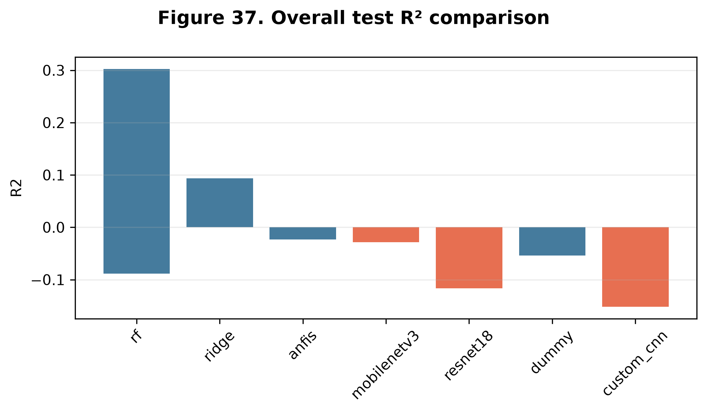
**Caption and interpretation.** Figure 38 was included to make the comparative analysis evidence inspectable rather than reducing it to a single summary number. It is titled “Overall Test R² Comparison” and is sourced from the repository figure export. The axis labels printed in the original graphic define the displayed variables and units; this report does not relabel them with unsupported units. Where this figure is part of the comparative prediction analysis, it uses 42 aligned saved regression images. The visible pattern should be read together with the associated table and the model/input provenance. It can show distribution, convergence, ranking, residual spread or sample-level variation, but it cannot establish causal visual mechanisms. The result should be read within the stated evidence boundary: targets are image-geometry research labels rather than recorded control commands, and any oracle-mask result is not a deployment-equivalent result.

#### Figure 39: Deep Model Size Versus Prediction Error
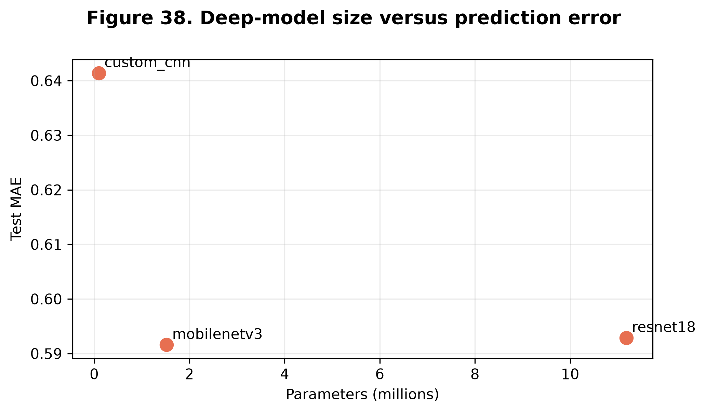
**Caption and interpretation.** Figure 39 was included to make the comparative analysis evidence inspectable rather than reducing it to a single summary number. It is titled “Deep Model Size Versus Prediction Error” and is sourced from the repository figure export. The axis labels printed in the original graphic define the displayed variables and units; this report does not relabel them with unsupported units. Where this figure is part of the comparative prediction analysis, it uses 42 aligned saved regression images. The visible pattern should be read together with the associated table and the model/input provenance. It can show distribution, convergence, ranking, residual spread or sample-level variation, but it cannot establish causal visual mechanisms. The result should be read within the stated evidence boundary: targets are image-geometry research labels rather than recorded control commands, and any oracle-mask result is not a deployment-equivalent result.

#### Figure 40: Deep Model Latency Versus Prediction Error
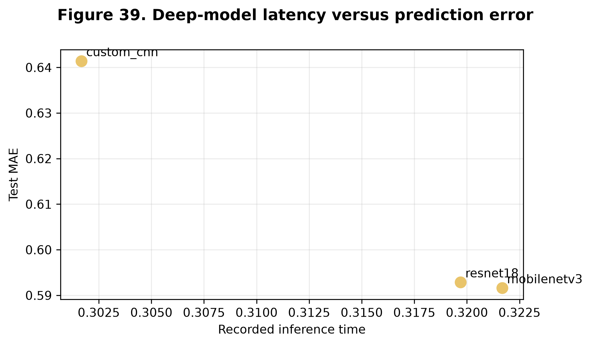
**Caption and interpretation.** Figure 40 was included to make the comparative analysis evidence inspectable rather than reducing it to a single summary number. It is titled “Deep Model Latency Versus Prediction Error” and is sourced from the repository figure export. The axis labels printed in the original graphic define the displayed variables and units; this report does not relabel them with unsupported units. Where this figure is part of the comparative prediction analysis, it uses 42 aligned saved regression images. The visible pattern should be read together with the associated table and the model/input provenance. It can show distribution, convergence, ranking, residual spread or sample-level variation, but it cannot establish causal visual mechanisms. The result should be read within the stated evidence boundary: targets are image-geometry research labels rather than recorded control commands, and any oracle-mask result is not a deployment-equivalent result.

#### Figure 41: Absolute Error Distribution Across Models
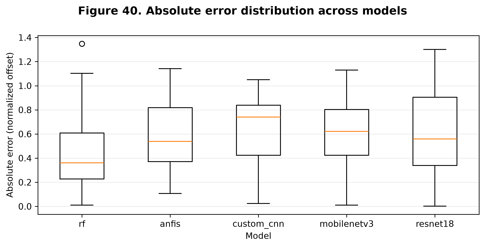
**Caption and interpretation.** Figure 41 was included to make the comparative analysis evidence inspectable rather than reducing it to a single summary number. It is titled “Absolute Error Distribution Across Models” and is sourced from the repository figure export. The axis labels printed in the original graphic define the displayed variables and units; this report does not relabel them with unsupported units. Where this figure is part of the comparative prediction analysis, it uses 42 aligned saved regression images. The visible pattern should be read together with the associated table and the model/input provenance. It can show distribution, convergence, ranking, residual spread or sample-level variation, but it cannot establish causal visual mechanisms. The result should be read within the stated evidence boundary: targets are image-geometry research labels rather than recorded control commands, and any oracle-mask result is not a deployment-equivalent result.

#### Figure 42: Verified Mae

**Caption and interpretation.** Figure 42 was included to make the final comparative analysis evidence inspectable rather than reducing it to a single summary number. It is titled “Verified Mae” and is sourced from the independently validated saved Phase B prediction exports. The axis labels printed in the original graphic define the displayed variables and units; this report does not relabel them with unsupported units. Where this figure is part of the comparative prediction analysis, it uses 42 aligned saved regression images. The visible pattern should be read together with the associated table and the model/input provenance. It can show distribution, convergence, ranking, residual spread or sample-level variation, but it cannot establish causal visual mechanisms. The result should be read within the stated evidence boundary: targets are image-geometry research labels rather than recorded control commands, and any oracle-mask result is not a deployment-equivalent result.

#### Figure 43: Verified Rmse

**Caption and interpretation.** Figure 43 was included to make the final comparative analysis evidence inspectable rather than reducing it to a single summary number. It is titled “Verified Rmse” and is sourced from the independently validated saved Phase B prediction exports. The axis labels printed in the original graphic define the displayed variables and units; this report does not relabel them with unsupported units. Where this figure is part of the comparative prediction analysis, it uses 42 aligned saved regression images. The visible pattern should be read together with the associated table and the model/input provenance. It can show distribution, convergence, ranking, residual spread or sample-level variation, but it cannot establish causal visual mechanisms. The result should be read within the stated evidence boundary: targets are image-geometry research labels rather than recorded control commands, and any oracle-mask result is not a deployment-equivalent result.

#### Figure 44: Verified R2
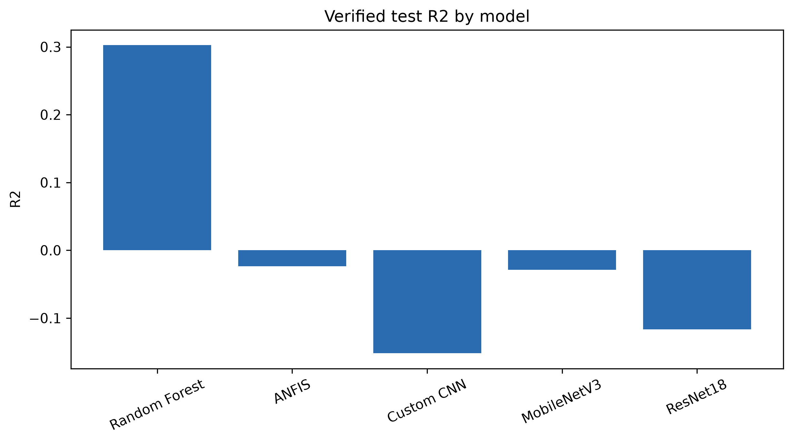
**Caption and interpretation.** Figure 44 was included to make the final comparative analysis evidence inspectable rather than reducing it to a single summary number. It is titled “Verified R2” and is sourced from the independently validated saved Phase B prediction exports. The axis labels printed in the original graphic define the displayed variables and units; this report does not relabel them with unsupported units. Where this figure is part of the comparative prediction analysis, it uses 42 aligned saved regression images. The visible pattern should be read together with the associated table and the model/input provenance. It can show distribution, convergence, ranking, residual spread or sample-level variation, but it cannot establish causal visual mechanisms. The result should be read within the stated evidence boundary: targets are image-geometry research labels rather than recorded control commands, and any oracle-mask result is not a deployment-equivalent result.

#### Figure 45: Mae Bootstrap Ci
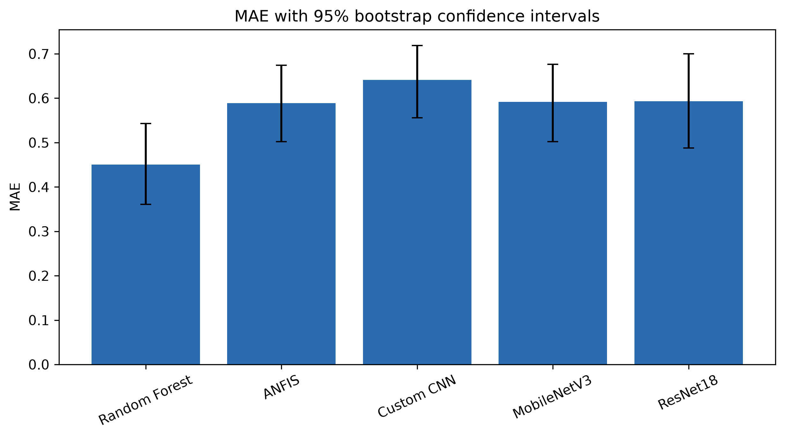
**Caption and interpretation.** Figure 45 was included to make the final comparative analysis evidence inspectable rather than reducing it to a single summary number. It is titled “Mae Bootstrap Ci” and is sourced from the independently validated saved Phase B prediction exports. The axis labels printed in the original graphic define the displayed variables and units; this report does not relabel them with unsupported units. Where this figure is part of the comparative prediction analysis, it uses 42 aligned saved regression images. The visible pattern should be read together with the associated table and the model/input provenance. It can show distribution, convergence, ranking, residual spread or sample-level variation, but it cannot establish causal visual mechanisms. The result should be read within the stated evidence boundary: targets are image-geometry research labels rather than recorded control commands, and any oracle-mask result is not a deployment-equivalent result.

#### Figure 46: Rmse Bootstrap Ci
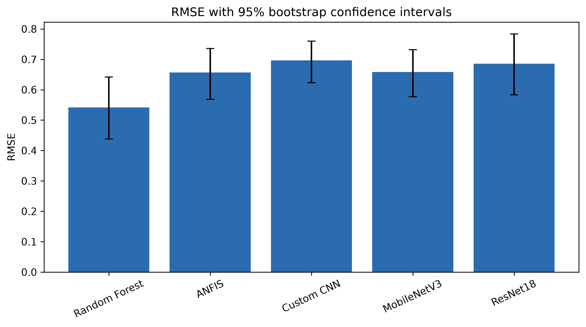
**Caption and interpretation.** Figure 46 was included to make the final comparative analysis evidence inspectable rather than reducing it to a single summary number. It is titled “Rmse Bootstrap Ci” and is sourced from the independently validated saved Phase B prediction exports. The axis labels printed in the original graphic define the displayed variables and units; this report does not relabel them with unsupported units. Where this figure is part of the comparative prediction analysis, it uses 42 aligned saved regression images. The visible pattern should be read together with the associated table and the model/input provenance. It can show distribution, convergence, ranking, residual spread or sample-level variation, but it cannot establish causal visual mechanisms. The result should be read within the stated evidence boundary: targets are image-geometry research labels rather than recorded control commands, and any oracle-mask result is not a deployment-equivalent result.

#### Figure 47: Common Test Mae
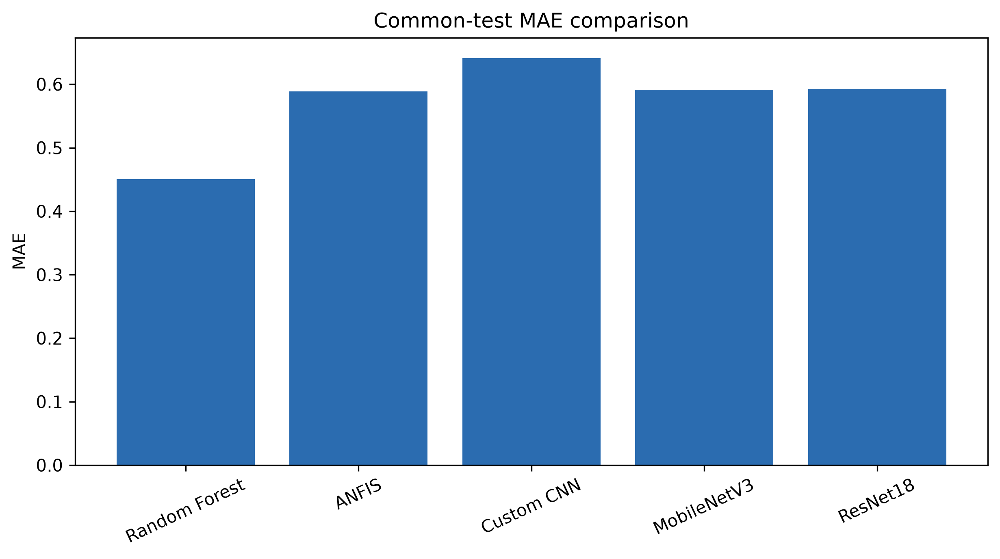
**Caption and interpretation.** Figure 47 was included to make the final comparative analysis evidence inspectable rather than reducing it to a single summary number. It is titled “Common Test Mae” and is sourced from the independently validated saved Phase B prediction exports. The axis labels printed in the original graphic define the displayed variables and units; this report does not relabel them with unsupported units. Where this figure is part of the comparative prediction analysis, it uses 42 aligned saved regression images. The visible pattern should be read together with the associated table and the model/input provenance. It can show distribution, convergence, ranking, residual spread or sample-level variation, but it cannot establish causal visual mechanisms. The result should be read within the stated evidence boundary: targets are image-geometry research labels rather than recorded control commands, and any oracle-mask result is not a deployment-equivalent result.

#### Figure 48: Common Test Rmse
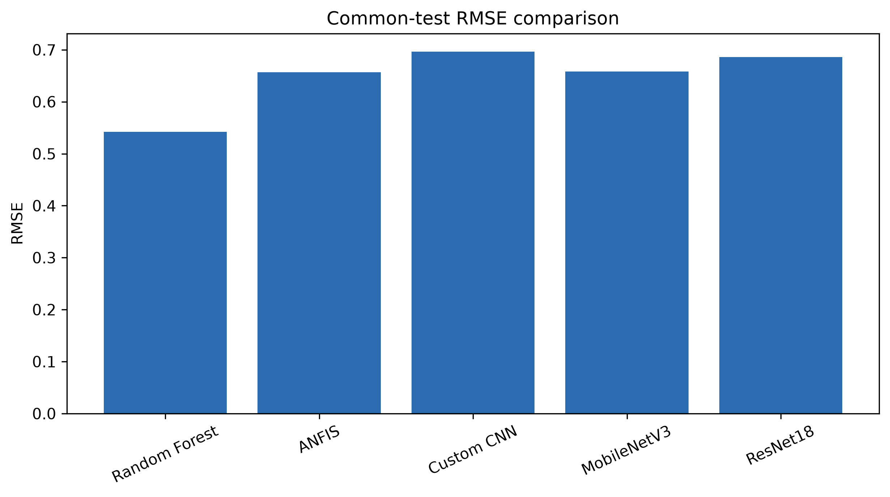
**Caption and interpretation.** Figure 48 was included to make the final comparative analysis evidence inspectable rather than reducing it to a single summary number. It is titled “Common Test Rmse” and is sourced from the independently validated saved Phase B prediction exports. The axis labels printed in the original graphic define the displayed variables and units; this report does not relabel them with unsupported units. Where this figure is part of the comparative prediction analysis, it uses 42 aligned saved regression images. The visible pattern should be read together with the associated table and the model/input provenance. It can show distribution, convergence, ranking, residual spread or sample-level variation, but it cannot establish causal visual mechanisms. The result should be read within the stated evidence boundary: targets are image-geometry research labels rather than recorded control commands, and any oracle-mask result is not a deployment-equivalent result.

#### Figure 49: Common Test Absolute Error Boxplots

**Caption and interpretation.** Figure 49 was included to make the final comparative analysis evidence inspectable rather than reducing it to a single summary number. It is titled “Common Test Absolute Error Boxplots” and is sourced from the independently validated saved Phase B prediction exports. The axis labels printed in the original graphic define the displayed variables and units; this report does not relabel them with unsupported units. Where this figure is part of the comparative prediction analysis, it uses 42 aligned saved regression images. The visible pattern should be read together with the associated table and the model/input provenance. It can show distribution, convergence, ranking, residual spread or sample-level variation, but it cannot establish causal visual mechanisms. The result should be read within the stated evidence boundary: targets are image-geometry research labels rather than recorded control commands, and any oracle-mask result is not a deployment-equivalent result.

#### Figure 50: Actual Vs Predicted

**Caption and interpretation.** Figure 50 was included to make the final comparative analysis evidence inspectable rather than reducing it to a single summary number. It is titled “Actual Vs Predicted” and is sourced from the independently validated saved Phase B prediction exports. The axis labels printed in the original graphic define the displayed variables and units; this report does not relabel them with unsupported units. Where this figure is part of the comparative prediction analysis, it uses 42 aligned saved regression images. The visible pattern should be read together with the associated table and the model/input provenance. It can show distribution, convergence, ranking, residual spread or sample-level variation, but it cannot establish causal visual mechanisms. The result should be read within the stated evidence boundary: targets are image-geometry research labels rather than recorded control commands, and any oracle-mask result is not a deployment-equivalent result.

#### Figure 51: Residual Comparison
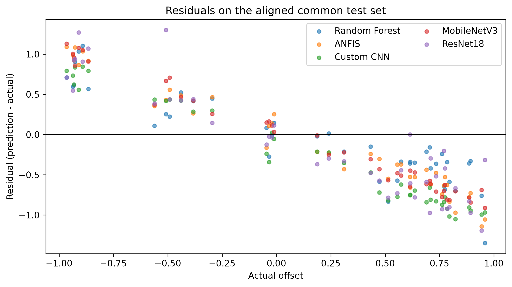
**Caption and interpretation.** Figure 51 was included to make the final comparative analysis evidence inspectable rather than reducing it to a single summary number. It is titled “Residual Comparison” and is sourced from the independently validated saved Phase B prediction exports. The axis labels printed in the original graphic define the displayed variables and units; this report does not relabel them with unsupported units. Where this figure is part of the comparative prediction analysis, it uses 42 aligned saved regression images. The visible pattern should be read together with the associated table and the model/input provenance. It can show distribution, convergence, ranking, residual spread or sample-level variation, but it cannot establish causal visual mechanisms. The result should be read within the stated evidence boundary: targets are image-geometry research labels rather than recorded control commands, and any oracle-mask result is not a deployment-equivalent result.

### Appendix B. Core Result Tables
#### Table 1. Independently verified regression metrics
| model | feature_source | test_n | MAE | RMSE | R2 | median_absolute_error | bias |
| --- | --- | --- | --- | --- | --- | --- | --- |
| Random Forest | oracle ground-truth masks | 42 | 0.4505698017042929 | 0.5420931192289319 | 0.30242764480182516 | 0.3614645244840745 | -0.08196536438966474 |
| ANFIS | oracle ground-truth masks | 42 | 0.5886896949761904 | 0.6565839887087348 | -0.02334494202326476 | 0.5385492780000001 | -0.11383432878571427 |
| Custom CNN | images | 42 | 0.6414214591595238 | 0.6965784109611107 | -0.1518117173197755 | 0.7394284849999999 | -0.28458394615000004 |
| MobileNetV3 | images | 42 | 0.5915980909523809 | 0.6582767348218261 | -0.0286283372489764 | 0.6213809050000001 | -0.09911925952380951 |
| ResNet18 | images | 42 | 0.592889465952381 | 0.685875004015314 | -0.11668690477811006 | 0.558940705 | -0.13521822357142857 |

The table uses raw saved actual/prediction values. Random Forest values are oracle-mask results; image models remain separate.

#### Table 2. Corrected directional classification metrics
| model | test_n | accuracy | balanced_accuracy | macro_f1 | kappa | MCC |
| --- | --- | --- | --- | --- | --- | --- |
| knn | 16 | 0.5 | 0.5 | 0.38888888888888884 | 0.2727272727272727 | 0.3872983346207417 |
| logistic | 32 | 0.6875 | 0.6458333333333334 | 0.6359126984126984 | 0.5 | 0.5031546054266276 |
| svm | 32 | 0.5 | 0.4375 | 0.4388888888888889 | 0.189873417721519 | 0.19019367350286515 |

The table uses saved hard labels. It does not support score-based ROC/AUC or calibration claims.

#### Table 3. Paired statistical comparisons
| model_a | model_b | common_n | difference_a_minus_b | ci95_low | ci95_high | holm_adjusted_p_value | interpretation |
| --- | --- | --- | --- | --- | --- | --- | --- |
| ANFIS | Custom CNN | 42 | -0.05273176418333333 | -0.11522754130297622 | 0.009258295022619017 | 0.6728487665691318 | no adjusted evidence of a difference |
| ANFIS | MobileNetV3 | 42 | -0.0029083959761904686 | -0.04736473992797616 | 0.04411531218988095 | 1.0 | no adjusted evidence of a difference |
| ANFIS | Random Forest | 42 | 0.13811989327189758 | 0.07329876549414631 | 0.20077843771957793 | 0.0023243739451572765 | evidence of different paired absolute errors |
| ANFIS | ResNet18 | 42 | -0.004199770976190472 | -0.08980560581964284 | 0.08359709388988094 | 1.0 | no adjusted evidence of a difference |
| Custom CNN | MobileNetV3 | 42 | 0.049823368207142865 | -0.012400191566250001 | 0.10790767961250002 | 0.38292044881836773 | no adjusted evidence of a difference |
| Custom CNN | Random Forest | 42 | 0.1908516574552309 | 0.11167281682865884 | 0.26891273749477157 | 0.0003362946836205083 | evidence of different paired absolute errors |
| Custom CNN | ResNet18 | 42 | 0.04853199320714283 | -0.044940528701726205 | 0.1388254700661904 | 0.9908590633913263 | no adjusted evidence of a difference |
| MobileNetV3 | Random Forest | 42 | 0.14102828924808802 | 0.06920750580723761 | 0.21294081692518868 | 0.010029022421804257 | evidence of different paired absolute errors |
| MobileNetV3 | ResNet18 | 42 | -0.001291375000000006 | -0.08252793811904761 | 0.07940473204761905 | 1.0 | no adjusted evidence of a difference |
| Random Forest | ResNet18 | 42 | -0.14231966424808803 | -0.2518840043439947 | -0.03137572043006993 | 0.06298719486585469 | no adjusted evidence of a difference |

Positive differences mean model B has lower absolute error. Holm-adjusted results address multiple pairwise testing.

#### Table 4. Bootstrap confidence intervals
| model | metric | estimate | ci95_low | ci95_high | repetitions | seed |
| --- | --- | --- | --- | --- | --- | --- |
| Random Forest | MAE | 0.4505698017042929 | 0.36107242250789556 | 0.5429774576804958 | 5000 | 20260928 |
| Random Forest | RMSE | 0.5420931192289319 | 0.43790468225186147 | 0.6416722663584055 | 5000 | 20260928 |
| Random Forest | R2 | 0.30242764480182516 | -0.010533437652719932 | 0.4928205252446697 | 5000 | 20260928 |
| ANFIS | MAE | 0.5886896949761904 | 0.5018303203970238 | 0.6739184834761905 | 5000 | 20260928 |
| ANFIS | RMSE | 0.6565839887087348 | 0.5681806021863947 | 0.7359515526670231 | 5000 | 20260928 |
| ANFIS | R2 | -0.02334494202326476 | -0.32467560248219896 | 0.09480724663460299 | 5000 | 20260928 |
| Custom CNN | MAE | 0.6414214591595238 | 0.5557841176922619 | 0.7189324788160715 | 5000 | 20260928 |
| Custom CNN | RMSE | 0.6965784109611107 | 0.6231866670024012 | 0.7601207124198576 | 5000 | 20260928 |
| Custom CNN | R2 | -0.1518117173197755 | -0.6849510119895944 | 0.053963356729458484 | 5000 | 20260928 |
| MobileNetV3 | MAE | 0.5915980909523809 | 0.5022173767619046 | 0.6766601637678571 | 5000 | 20260928 |
| MobileNetV3 | RMSE | 0.6582767348218261 | 0.5772954279265049 | 0.7319876854758193 | 5000 | 20260928 |
| MobileNetV3 | R2 | -0.0286283372489764 | -0.28146126393301957 | 0.056432749959911654 | 5000 | 20260928 |
| ResNet18 | MAE | 0.592889465952381 | 0.4879329108869047 | 0.7002675799940477 | 5000 | 20260928 |
| ResNet18 | RMSE | 0.685875004015314 | 0.5834967422084822 | 0.7836168968610253 | 5000 | 20260928 |
| ResNet18 | R2 | -0.11668690477811006 | -0.576434112853616 | 0.13474857786706673 | 5000 | 20260928 |

Intervals are percentile bootstrap intervals from image-level resampling.

### Appendix C. Reproducibility Execution Map
1. Run dataset/annotation notebooks and preserve audit reports. 2. Use the implemented segmentation workflow only when GPU artefacts can be exported. 3. Prepare features/targets with the stored policies. 4. Keep validation selection separate from tests. 5. Run `src/phase_C_analysis.py` locally for saved-prediction validation. 6. Run this report builder and render the DOCX to PDF. GPU is required only for segmentation/deep training; final comparative analysis and report generation are CPU-local.
