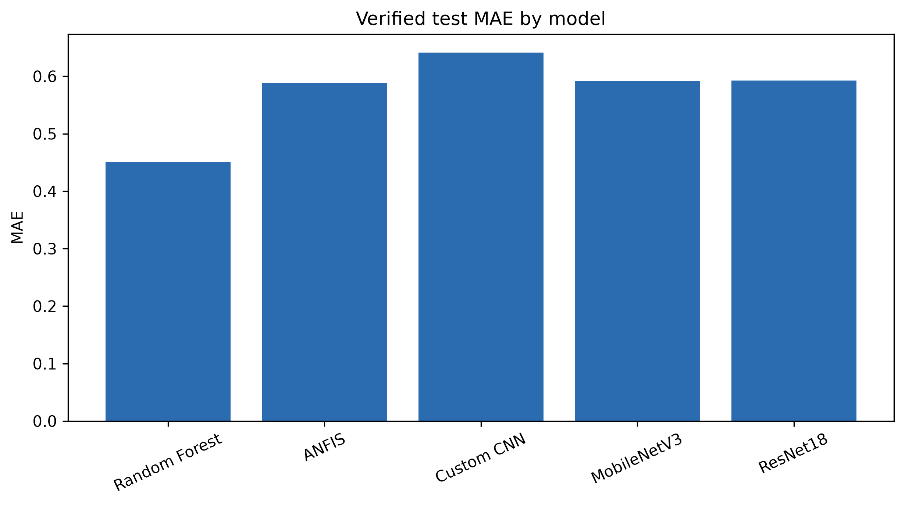
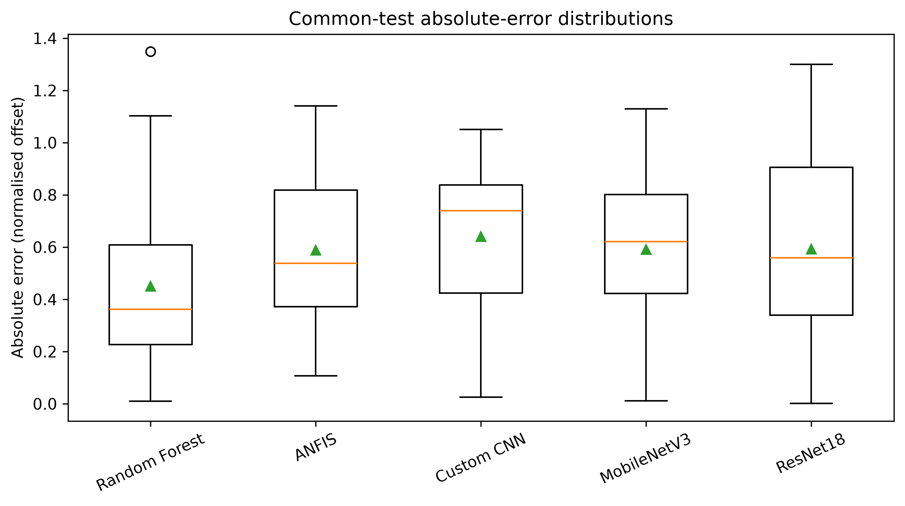
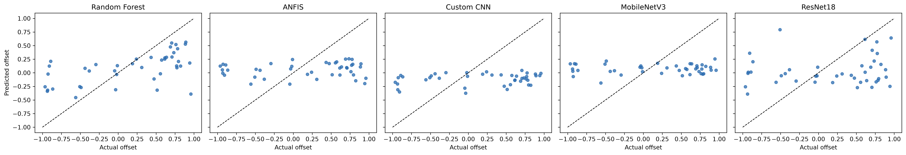

# Vision Based Navigation and Control for Autonomous Cassava Farm Robots
## Complete Research Technical Report
**Version:** Phase C evidence-based comparative analysis  
**Date:** 2026-09-28

## Executive Summary
This research examined how annotated cassava-farm images may support vision-based navigation research. The workflow audited a 3-class YOLO polygon dataset, checked annotations, derived provisional path-centre navigation targets, constructed engineered features, and evaluated classical ML, ANFIS and image-only deep regression models. The supplied evidence contains 42 aligned saved test predictions for Random Forest, ANFIS, Custom CNN, MobileNetV3 and ResNet18. Phase C recomputed each metric from these predictions, constructed a common test set, and used image-level bootstrap confidence intervals and paired Wilcoxon tests with Holm correction.

Random Forest produced the lowest saved-test MAE (0.451) and RMSE (0.542); however, its features come from ground-truth segmentation masks, so it is an oracle upper-bound result, not a direct deployment-equivalent result. Among image-only models, MobileNetV3 had the lowest MAE (0.592). No physical robot, measured steering command, trained local segmentation result, predicted-mask downstream pipeline or edge deployment is verified by this repository.

## 1. Introduction and research aim
Cassava rows contain variable leaves, ridges and visible paths. A future autonomous robot needs perception that can describe where the path lies. This work evaluates an AI/ML research pipeline, not a validated motor controller. The stated objectives were to validate the data, investigate ANFIS and deep models, compare model families fairly and produce reproducible statistical results.

## 2. Dataset, audit and annotation validation
The usable project data contain 802 labelled samples: 602 train, 120 validation and 80 test. The authoritative classes are `path`, `cassava_leaves` and `ridge`. Audit reports record 28,655 structurally valid polygons, 216 size warnings and 278 manual-review candidates. Exact-hash duplicate checks did not identify cross-split duplicates, but cannot establish independence of nearby video frames or field sites. These are quality checks, not a claim of broad field generalisation.

## 3. Navigation targets and feature engineering
The continuous target is the normalised horizontal displacement between path centre and image centre. Directional labels are left, forward and right (with a broader stop/uncertain concept in configuration); they are derived labels rather than motor commands. Feature engineering includes geometry, colour, texture, orientation and obstruction cues. Leakage prevention excludes path-centre equivalents from target prediction. Classical ML and ANFIS use ground-truth-mask features: this is an oracle condition and is explicitly separated from image-only networks.

## 4. Models and Phase B evidence
Random Forest was the completed classical regression reference. ANFIS used five selected features and 3 membership functions per input, yielding 243 recorded rules. The image networks are a custom CNN, transfer-learned MobileNetV3 and transfer-learned ResNet18. MobileNetV3 is relevant to future constrained devices because it is designed for efficiency; no actual device deployment is claimed. ResNet18 uses residual connections that help optimisation of deeper representations. Training histories and configurations are discussed only where stored; Phase C does not reconstruct missing training evidence.

## 5. Phase C validation and comparison
Phase C parsed saved actual/predicted values and independently recomputed MAE, RMSE, R2, median absolute error, signed bias, residual standard deviation and maximum absolute error. All five eligible models have exactly 42 identical image IDs, so the comparison is paired. The corrected classification table recomputes accuracy, balanced accuracy, macro/weighted metrics, kappa, MCC and class metrics from saved hard labels. ROC/AUC, PR and calibration curves are not reported because scores/probabilities were not supplied.

### Verified regression results

| model | feature_source | test_n | MAE | RMSE | R2 | bias |
| --- | --- | --- | --- | --- | --- | --- |
| Random Forest | oracle ground-truth masks | 42 | 0.4505698017042929 | 0.5420931192289319 | 0.30242764480182516 | -0.08196536438966474 |
| ANFIS | oracle ground-truth masks | 42 | 0.5886896949761904 | 0.6565839887087348 | -0.02334494202326476 | -0.11383432878571427 |
| Custom CNN | images | 42 | 0.6414214591595238 | 0.6965784109611107 | -0.1518117173197755 | -0.28458394615000004 |
| MobileNetV3 | images | 42 | 0.5915980909523809 | 0.6582767348218261 | -0.0286283372489764 | -0.09911925952380951 |
| ResNet18 | images | 42 | 0.592889465952381 | 0.685875004015314 | -0.11668690477811006 | -0.13521822357142857 |

**Figure - verified test MAE.** The bars show MAE in normalised offset units calculated from each saved prediction file. Lower is better. Random Forest is lowest, but its oracle mask source means the bar should be treated as an upper-bound tabular experiment rather than a deployment ranking.

**Figure - paired absolute errors.** Each distribution contains the same 42 images, allowing the spread and large errors to be inspected alongside mean metrics. The figure shows residual variability rather than a causal explanation for individual failures.

## 6. Statistical and uncertainty analysis
Bootstrap intervals resample image-level prediction/target pairs 5,000 times with seed 20260928 and use percentile 95% intervals. Pairwise Wilcoxon tests operate on image-level absolute-error differences; Holm correction controls the family-wise error rate across pairwise comparisons. The saved comparison table records effect sizes as rank-biserial summaries. Lower aggregate RMSE alone is not labelled statistically better.

| model_a | model_b | common_n | difference_a_minus_b | ci95_low | ci95_high | holm_adjusted_p_value | interpretation |
| --- | --- | --- | --- | --- | --- | --- | --- |
| ANFIS | Custom CNN | 42 | -0.05273176418333333 | -0.11522754130297622 | 0.009258295022619017 | 0.6728487665691318 | no adjusted evidence of a difference |
| ANFIS | MobileNetV3 | 42 | -0.0029083959761904686 | -0.04736473992797616 | 0.04411531218988095 | 1.0 | no adjusted evidence of a difference |
| ANFIS | Random Forest | 42 | 0.13811989327189758 | 0.07329876549414631 | 0.20077843771957793 | 0.0023243739451572765 | evidence of different paired absolute errors |
| ANFIS | ResNet18 | 42 | -0.004199770976190472 | -0.08980560581964284 | 0.08359709388988094 | 1.0 | no adjusted evidence of a difference |
| Custom CNN | MobileNetV3 | 42 | 0.049823368207142865 | -0.012400191566250001 | 0.10790767961250002 | 0.38292044881836773 | no adjusted evidence of a difference |
| Custom CNN | Random Forest | 42 | 0.1908516574552309 | 0.11167281682865884 | 0.26891273749477157 | 0.0003362946836205083 | evidence of different paired absolute errors |
| Custom CNN | ResNet18 | 42 | 0.04853199320714283 | -0.044940528701726205 | 0.1388254700661904 | 0.9908590633913263 | no adjusted evidence of a difference |
| MobileNetV3 | Random Forest | 42 | 0.14102828924808802 | 0.06920750580723761 | 0.21294081692518868 | 0.010029022421804257 | evidence of different paired absolute errors |
| MobileNetV3 | ResNet18 | 42 | -0.001291375000000006 | -0.08252793811904761 | 0.07940473204761905 | 1.0 | no adjusted evidence of a difference |
| Random Forest | ResNet18 | 42 | -0.14231966424808803 | -0.2518840043439947 | -0.03137572043006993 | 0.06298719486585469 | no adjusted evidence of a difference |

## 7. Error and computational interpretation
Residual figures plot prediction minus actual offset against actual offset. They reveal where an output under- or over-estimates the geometry-derived target but do not prove visual causes. The deepest evidence supports only the stored timing values, parameter counts and model sizes; timings from different environments must not be compared as a hardware benchmark. Any future robot must be tested with camera calibration, latency and safety constraints.

**Figure - actual versus predicted common-test offsets.** The dashed line is perfect prediction. Scatter around it demonstrates the difficulty of the 42-image test set and makes the compression of several models toward zero visible. It does not demonstrate real steering accuracy.

## 8. Directional classification
The corrected saved-label results are shown below. Balanced accuracy and macro F1 are included because ordinary accuracy alone can conceal uneven class performance. This dataset export has no probability scores, so confidence calibration and ROC/AUC are intentionally omitted.

| model | test_n | accuracy | balanced_accuracy | macro_f1 | kappa | MCC |
| --- | --- | --- | --- | --- | --- | --- |
| knn | 16 | 0.5 | 0.5 | 0.38888888888888884 | 0.2727272727272727 | 0.3872983346207417 |
| logistic | 32 | 0.6875 | 0.6458333333333334 | 0.6359126984126984 | 0.5 | 0.5031546054266276 |
| svm | 32 | 0.5 | 0.4375 | 0.4388888888888889 | 0.189873417721519 | 0.19019367350286515 |

## 9. Limitations, practical implications and future work
The main limitations are small test evidence, geometry-derived targets, oracle-mask features, absent predicted-mask downstream features, missing trained segmentation outputs locally, hard-label-only classification exports, incomplete histories, environmental diversity uncertainty and no physical robot validation. The results can inform a future perception/control study but cannot be connected directly to motors. Next work should collect measured steering/control data across farms and lighting, generate out-of-fold predicted-mask features, validate segmentation, test temporal/sensor-fusion methods, profile on a target device and conduct safety-controlled robot trials.

## 10. Conclusion
Phase C turns the supplied frozen Phase B outputs into independently validated metrics, paired comparison tables and reproducible uncertainty analysis. It supports a careful conclusion: the oracle Random Forest was numerically strongest on these exports, while MobileNetV3 was the strongest saved image-only MAE result. The research is technically documented for manuscript preparation, subject to preserving its limitations and not overclaiming deployment validity.

## Appendix - Figures and reproducibility
The complete project figure inventory, figure explanations, table explanations and rerun instructions are in the companion reports. Phase C figures are high-resolution PNG/PDF pairs and are indexed in `phase_C_results/figure_index.csv`.
